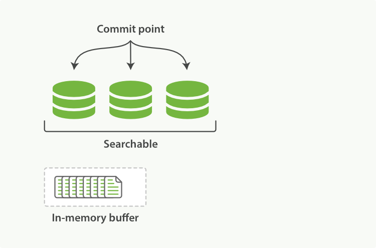
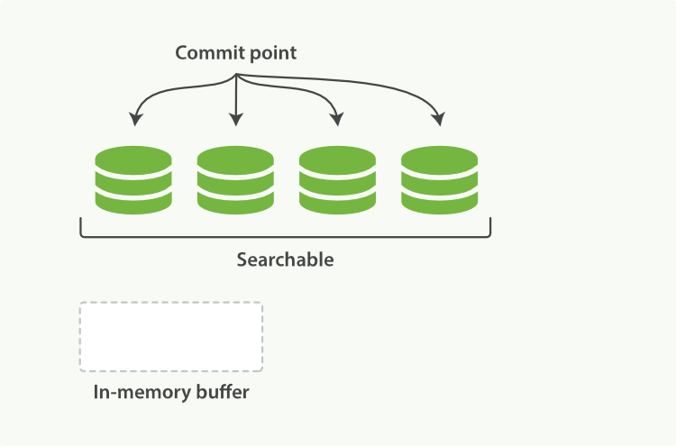
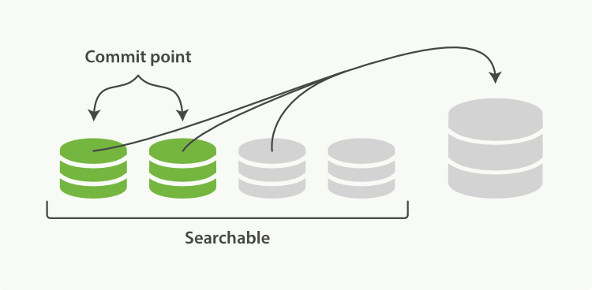

## 索引管理

我们已经看到 Elasticsearch 让开发一个新的应用变得简单，不需要任何预先计划或设置。 不过，要不了多久你就会开始想要优化索引和搜索过程，以便更好地适合您的特定用例。 这些定制几乎围绕着索引和类型的方方面面，在本章，我们将介绍管理索引和类型映射的 API 以及一些最重要的设置。


### 创建一个索引

到目前为止, 我们已经通过索引一篇文档创建了一个新的索引 。这个索引采用的是默认的配置，新的字段通过动态映射的方式被添加到类型映射。现在我们需要对这个建立索引的过程做更多的控制：我们想要确保这个索引有数量适中的主分片，并且在我们索引任何数据 *之前* ，分析器和映射已经被建立好。

为了达到这个目的，我们需要手动创建索引，在请求体里面传入设置或类型映射，如下所示：

```js
PUT /my_index
{
    "settings": { ... any settings ... },
    "mappings": {
        "type_one": { ... any mappings ... },
        "type_two": { ... any mappings ... },
        ...
    }
}
```

如果你想禁止自动创建索引，你 可以通过在 `config/elasticsearch.yml` 的每个节点下添加下面的配置：

```js
action.auto_create_index: false
```
>    我们会在之后讨论你怎么用 [索引模板](https://www.elastic.co/guide/cn/elasticsearch/guide/current/index-templates.html) 来预配置开启自动创建索引。这在索引日志数据的时候尤其有用：你将日志数据索引在一个以日期结尾命名的索引上，子夜时分，一个预配置的新索引将会自动进行创建。


### 删除一个索引

用以下的请求来 删除索引:

```js
DELETE /my_index
```

你也可以这样删除多个索引：

```js
DELETE /index_one,index_two
DELETE /index_*
```

你甚至可以这样删除 *全部* 索引：

```js
DELETE /_all
DELETE /*
```
>    对一些人来说，能够用单个命令来删除所有数据可能会导致可怕的后果。如果你想要避免意外的大量删除, 你可以在你的 `elasticsearch.yml` 做如下配置：
>  
>  ```
>  action.destructive_requires_name: true
>  ```
>  
>  这个设置使删除只限于特定名称指向的数据, 而不允许通过指定 `_all` 或通配符来删除指定索引库。你同样可以通过 [Cluster State API](https://www.elastic.co/guide/cn/elasticsearch/guide/current/_changing_settings_dynamically.html) 动态的更新这个设置。


### 索引设置

你可以通过修改配置来自定义索引行为，详细配置参照 [索引模块](https://www.elastic.co/guide/en/elasticsearch/reference/5.6/index-modules.html)
>    Elasticsearch 提供了优化好的默认配置。 除非你理解这些配置的作用并且知道为什么要去修改，否则不要随意修改。

下面是两个 最重要的设置：

- `number_of_shards`

  每个索引的主分片数，默认值是 `5` 。这个配置在索引创建后不能修改。

- `number_of_replicas`

  每个主分片的副本数，默认值是 `1` 。对于活动的索引库，这个配置可以随时修改。

例如，我们可以创建只有 一个主分片，没有副本的小索引：

```js
PUT /my_temp_index
{
    "settings": {
        "number_of_shards" :   1,
        "number_of_replicas" : 0
    }
}
```


然后，我们可以用 `update-index-settings` API 动态修改副本数：

```js
PUT /my_temp_index/_settings
{
    "number_of_replicas": 1
}
```


### 配置分析器

第三个重要的索引设置是 `analysis` 部分， 用来配置已存在的分析器或针对你的索引创建新的自定义分析器。

在 [分析与分析器](https://www.elastic.co/guide/cn/elasticsearch/guide/current/analysis-intro.html) ，我们介绍了一些内置的 分析器，用于将全文字符串转换为适合搜索的倒排索引。

`standard` 分析器是用于全文字段的默认分析器， 对于大部分西方语系来说是一个不错的选择。 它包括了以下几点：

- `standard` 分词器，通过单词边界分割输入的文本。
- `standard` 语汇单元过滤器，目的是整理分词器触发的语汇单元（但是目前什么都没做）。
- `lowercase` 语汇单元过滤器，转换所有的语汇单元为小写。
- `stop` 语汇单元过滤器，删除停用词--对搜索相关性影响不大的常用词，如 `a` ， `the` ， `and` ， `is`。

默认情况下，停用词过滤器是被禁用的。如需启用它，你可以通过创建一个基于 `standard` 分析器的自定义分析器并设置 `stopwords` 参数。 可以给分析器提供一个停用词列表，或者告知使用一个基于特定语言的预定义停用词列表。

在下面的例子中，我们创建了一个新的分析器，叫做 `es_std` ， 并使用预定义的 西班牙语停用词列表：

```js
PUT /spanish_docs
{
    "settings": {
        "analysis": {
            "analyzer": {
                "es_std": {
                    "type":      "standard",
                    "stopwords": "_spanish_"
                }
            }
        }
    }
}
```


`es_std` 分析器不是全局的--它仅仅存在于我们定义的 `spanish_docs` 索引中。 为了使用 `analyze` API来对它进行测试，我们必须使用特定的索引名：

```js
GET /spanish_docs/_analyze?analyzer=es_std
El veloz zorro marrón
```


简化的结果显示西班牙语停用词 `El` 已被正确的移除：

```js
{
  "tokens" : [
    { "token" :    "veloz",   "position" : 2 },
    { "token" :    "zorro",   "position" : 3 },
    { "token" :    "marrón",  "position" : 4 }
  ]
}
```


### 自定义分析器

虽然Elasticsearch带有一些现成的分析器，然而在分析器上Elasticsearch真正的强大之处在于，你可以通过在一个适合你的特定数据的设置之中组合字符过滤器、分词器、词汇单元过滤器来创建自定义的分析器。

在 [分析与分析器](https://www.elastic.co/guide/cn/elasticsearch/guide/current/analysis-intro.html) 我们说过，一个 *分析器* 就是在一个包里面组合了三种函数的一个包装器， 三种函数按照顺序被执行:

- 字符过滤器

  字符过滤器 用来 `整理` 一个尚未被分词的字符串。例如，如果我们的文本是HTML格式的，它会包含像 `<p>` 或者 `<div>` 这样的HTML标签，这些标签是我们不想索引的。我们可以使用 [`html清除` 字符过滤器](https://www.elastic.co/guide/en/elasticsearch/reference/5.6/analysis-htmlstrip-charfilter.html) 来移除掉所有的HTML标签，并且像把 `&Aacute;` 转换为相对应的Unicode字符 `Á` 这样，转换HTML实体。一个分析器可能有0个或者多个字符过滤器。

- 分词器

  一个分析器 *必须* 有一个唯一的分词器。 分词器把字符串分解成单个词条或者词汇单元。 `标准` 分析器里使用的 [`标准` 分词器](https://www.elastic.co/guide/en/elasticsearch/reference/5.6/analysis-standard-tokenizer.html) 把一个字符串根据单词边界分解成单个词条，并且移除掉大部分的标点符号，然而还有其他不同行为的分词器存在。例如， [`关键词` 分词器](https://www.elastic.co/guide/en/elasticsearch/reference/5.6/analysis-keyword-tokenizer.html) 完整地输出 接收到的同样的字符串，并不做任何分词。 [`空格` 分词器](https://www.elastic.co/guide/en/elasticsearch/reference/5.6/analysis-whitespace-tokenizer.html) 只根据空格分割文本 。 [`正则` 分词器](https://www.elastic.co/guide/en/elasticsearch/reference/5.6/analysis-pattern-tokenizer.html) 根据匹配正则表达式来分割文本 。

- 词单元过滤器

  经过分词，作为结果的 *词单元流* 会按照指定的顺序通过指定的词单元过滤器 。词单元过滤器可以修改、添加或者移除词单元。我们已经提到过 [`lowercase` ](http://www.elastic.co/guide/en/elasticsearch/reference/current/analysis-lowercase-tokenizer.html)和 [`stop` 词过滤器](https://www.elastic.co/guide/en/elasticsearch/reference/5.6/analysis-stop-tokenfilter.html) ，但是在 Elasticsearch 里面还有很多可供选择的词单元过滤器。 [词干过滤器](https://www.elastic.co/guide/en/elasticsearch/reference/5.6/analysis-stemmer-tokenfilter.html) 把单词 `遏制` 为 词干。 [`ascii_folding` 过滤器](https://www.elastic.co/guide/en/elasticsearch/reference/5.6/analysis-asciifolding-tokenfilter.html)移除变音符，把一个像 `"très"` 这样的词转换为 `"tres"` 。 [`ngram`](https://www.elastic.co/guide/en/elasticsearch/reference/5.6/analysis-ngram-tokenfilter.html) 和 [`edge_ngram` 词单元过滤器](https://www.elastic.co/guide/en/elasticsearch/reference/5.6/analysis-edgengram-tokenfilter.html) 可以产生 适合用于部分匹配或者自动补全的词单元。

在 [深入搜索](https://www.elastic.co/guide/cn/elasticsearch/guide/current/search-in-depth.html)，我们讨论了在哪里使用，以及怎样使用分词器和过滤器。但是首先，我们需要解释一下怎样创建自定义的分析器。

**创建一个自定义分析器**

和我们之前配置 `es_std` 分析器一样，我们可以在 `analysis` 下的相应位置设置字符过滤器、分词器和词单元过滤器:

```js
PUT /my_index
{
    "settings": {
        "analysis": {
            "char_filter": { ... custom character filters ... },
            "tokenizer":   { ...    custom tokenizers     ... },
            "filter":      { ...   custom token filters   ... },
            "analyzer":    { ...    custom analyzers      ... }
        }
    }
}
```

作为示范，让我们一起来创建一个自定义分析器吧，这个分析器可以做到下面的这些事:

1. 使用 `html清除` 字符过滤器移除HTML部分。

2. 使用一个自定义的 `映射` 字符过滤器把 `&` 替换为 `" and "` ：

   ```js
   "char_filter": {
       "&_to_and": {
           "type":       "mapping",
           "mappings": [ "&=> and "]
       }
   }
   ```

3. 使用 `标准` 分词器分词。

4. 小写词条，使用 `小写` 词过滤器处理。

5. 使用自定义 `停止` 词过滤器移除自定义的停止词列表中包含的词：

   ```js
   "filter": {
       "my_stopwords": {
           "type":        "stop",
           "stopwords": [ "the", "a" ]
       }
   }
   ```

我们的分析器定义用我们之前已经设置好的自定义过滤器组合了已经定义好的分词器和过滤器：

```js
"analyzer": {
    "my_analyzer": {
        "type":           "custom",
        "char_filter":  [ "html_strip", "&_to_and" ],
        "tokenizer":      "standard",
        "filter":       [ "lowercase", "my_stopwords" ]
    }
}
```

汇总起来，完整的 `创建索引` 请求 看起来应该像这样：

```js
PUT /my_index
{
    "settings": {
        "analysis": {
            "char_filter": {
                "&_to_and": {
                    "type":       "mapping",
                    "mappings": [ "&=> and "]
            }},
            "filter": {
                "my_stopwords": {
                    "type":       "stop",
                    "stopwords": [ "the", "a" ]
            }},
            "analyzer": {
                "my_analyzer": {
                    "type":         "custom",
                    "char_filter":  [ "html_strip", "&_to_and" ],
                    "tokenizer":    "standard",
                    "filter":       [ "lowercase", "my_stopwords" ]
            }}
}}}
```

索引被创建以后，使用 `analyze` API 来 测试这个新的分析器：

```js
GET /my_index/_analyze?analyzer=my_analyzer
The quick & brown fox
```


下面的缩略结果展示出我们的分析器正在正确地运行：

```js
{
  "tokens" : [
      { "token" :   "quick",    "position" : 2 },
      { "token" :   "and",      "position" : 3 },
      { "token" :   "brown",    "position" : 4 },
      { "token" :   "fox",      "position" : 5 }
    ]
}
```

这个分析器现在是没有多大用处的，除非我们告诉 Elasticsearch在哪里用上它。我们可以像下面这样把这个分析器应用在一个 `string` 字段上：

```js
PUT /my_index/_mapping/my_type
{
    "properties": {
        "title": {
            "type":      "string",
            "analyzer":  "my_analyzer"
        }
    }
}
```


### 类型和映射

*类型* 在 Elasticsearch 中表示一类相似的文档。 类型由 *名称* —比如 `user` 或 `blogpost` —和 *映射* 组成。

*映射*, 就像数据库中的 schema ，描述了文档可能具有的字段或 *属性* 、 每个字段的数据类型—比如 `string`, `integer` 或 `date` —以及Lucene是如何索引和存储这些字段的。

类型可以很好的抽象划分相似但不相同的数据。但由于 Lucene 的处理方式，类型的使用有些限制。

**Lucene 如何处理文档**

在 Lucene 中，一个文档由一组简单的键值对组成。 每个字段都可以有多个值，但至少要有一个值。 类似的，一个字符串可以通过分析过程转化为多个值。Lucene 不关心这些值是字符串、数字或日期--所有的值都被当做 *不透明字节* 。

当我们在 Lucene 中索引一个文档时，每个字段的值都被添加到相关字段的倒排索引中。你也可以将未处理的原始数据 *存储* 起来，以便这些原始数据在之后也可以被检索到。

**类型是如何实现的**

Elasticsearch 类型是 以 Lucene 处理文档的这个方式为基础来实现的。一个索引可以有多个类型，这些类型的文档可以存储在相同的索引中。

Lucene 没有文档类型的概念，每个文档的类型名被存储在一个叫 `_type` 的元数据字段上。 当我们要检索某个类型的文档时, Elasticsearch 通过在 `_type` 字段上使用过滤器限制只返回这个类型的文档。

Lucene 也没有映射的概念。 映射是 Elasticsearch 将复杂 JSON 文档 *映射* 成 Lucene 需要的扁平化数据的方式。

例如，在 `user` 类型中， `name` 字段的映射可以声明这个字段是 `string` 类型，并且它的值被索引到名叫 `name` 的倒排索引之前，需要通过 `whitespace` 分词器分析：

```js
"name": {
    "type":     "string",
    "analyzer": "whitespace"
}
```

**避免类型陷阱**

这导致了一个有趣的思想实验： 如果有两个不同的类型，每个类型都有同名的字段，但映射不同（例如：一个是字符串一个是数字），将会出现什么情况？

简单回答是，Elasticsearch 不会允许你定义这个映射。当你配置这个映射时，将会出现异常。

详细回答是，每个 Lucene 索引中的所有字段都包含一个单一的、扁平的模式。一个特定字段可以映射成 string 类型也可以是 number 类型，但是不能两者兼具。因为类型是 Elasticsearch 添加的 *优于* Lucene 的额外机制（以元数据 `_type` 字段的形式），在 Elasticsearch 中的所有类型最终都共享相同的映射。

以 `data` 索引中两种类型的映射为例：

```js
{
   "data": {
      "mappings": {
         "people": {
            "properties": {
               "name": {
                  "type": "string",
               },
               "address": {
                  "type": "string"
               }
            }
         },
         "transactions": {
            "properties": {
               "timestamp": {
                  "type": "date",
                  "format": "strict_date_optional_time"
               },
               "message": {
                  "type": "string"
               }
            }
         }
      }
   }
}
```

每个类型定义两个字段 (分别是 `"name"`/`"address"` 和 `"timestamp"`/`"message"` )。它们看起来是相互独立的，但在后台 Lucene 将创建一个映射，如:

```js
{
   "data": {
      "mappings": {
        "_type": {
          "type": "string",
          "index": "not_analyzed"
        },
        "name": {
          "type": "string"
        }
        "address": {
          "type": "string"
        }
        "timestamp": {
          "type": "long"
        }
        "message": {
          "type": "string"
        }
      }
   }
}
```

*注: 这不是真实有效的映射语法，只是用于演示*

对于整个索引，映射在本质上被 *扁平化* 成一个单一的、全局的模式。这就是为什么两个类型不能定义冲突的字段：当映射被扁平化时，Lucene 不知道如何去处理。

**类型结论**

那么，这个讨论的结论是什么？技术上讲，多个类型可以在相同的索引中存在，只要它们的字段不冲突（要么因为字段是互为独占模式，要么因为它们共享相同的字段）。

重要的一点是: 类型可以很好的区分同一个集合中的不同细分。在不同的细分中数据的整体模式是相同的（或相似的）。

类型不适合 *完全不同类型的数据* 。如果两个类型的字段集是互不相同的，这就意味着索引中将有一半的数据是空的（字段将是 *稀疏的* ），最终将导致性能问题。在这种情况下，最好是使用两个单独的索引。

总结：

- **正确:** 将 `kitchen` 和 `lawn-care` 类型放在 `products` 索引中, 因为这两种类型基本上是相同的模式
- **错误:** 将 `products` 和 `logs` 类型放在 `data` 索引中, 因为这两种类型互不相同。应该将它们放在不同的索引中。


### 根对象

映射的最高一层被称为 *根对象* ，它可能包含下面几项：

- 一个 *properties* 节点，列出了文档中可能包含的每个字段的映射
- 各种元数据字段，它们都以一个下划线开头，例如 `_type` 、 `_id` 和 `_source`
- 设置项，控制如何动态处理新的字段，例如 `analyzer` 、 `dynamic_date_formats` 和`dynamic_templates`
- 其他设置，可以同时应用在根对象和其他 `object` 类型的字段上，例如 `enabled` 、 `dynamic` 和 `include_in_all`

**属性**

我们已经在 [核心简单域类型](https://www.elastic.co/guide/cn/elasticsearch/guide/current/mapping-intro.html#core-fields) 和 [复杂核心域类型](https://www.elastic.co/guide/cn/elasticsearch/guide/current/complex-core-fields.html) 章节中介绍过文档字段和属性的三个 最重要的设置：

- `type`

  字段的数据类型，例如 `string` 或 `date`

- `index`

  字段是否应当被当成全文来搜索（ `analyzed` ），或被当成一个准确的值（ `not_analyzed` ），还是完全不可被搜索（ `no` ）

- `analyzer`

  确定在索引和搜索时全文字段使用的 `analyzer`

我们将在本书的后续部分讨论其他字段类型，例如 `ip` 、 `geo_point` 和 `geo_shape` 。

**元数据: _source 字段**

默认地，Elasticsearch 在 `_source` 字段存储代表文档体的JSON字符串。和所有被存储的字段一样， `_source` 字段在被写入磁盘之前先会被压缩。

这个字段的存储几乎总是我们想要的，因为它意味着下面的这些：

- 搜索结果包括了整个可用的文档——不需要额外的从另一个的数据仓库来取文档。
- 如果没有 `_source` 字段，部分 `update` 请求不会生效。
- 当你的映射改变时，你需要重新索引你的数据，有了_source字段你可以直接从Elasticsearch这样做，而不必从另一个（通常是速度更慢的）数据仓库取回你的所有文档。
- 当你不需要看到整个文档时，单个字段可以从 `_source` 字段提取和通过 `get` 或者 `search` 请求返回。
- 调试查询语句更加简单，因为你可以直接看到每个文档包括什么，而不是从一列id猜测它们的内容。

然而，存储 `_source` 字段的确要使用磁盘空间。如果上面的原因对你来说没有一个是重要的，你可以用下面的映射禁用 `_source` 字段：

```js
PUT /my_index
{
    "mappings": {
        "my_type": {
            "_source": {
                "enabled":  false
            }
        }
    }
}
```

在一个搜索请求里，你可以通过在请求体中指定 `_source` 参数，来达到只获取特定的字段的效果：

```js
GET /_search
{
    "query":   { "match_all": {}},
    "_source": [ "title", "created" ]
}
```


这些字段的值会从 `_source` 字段被提取和返回，而不是返回整个 `_source` 。

---

>  **Stored Fields 被存储字段**
>  
>  为了之后的检索，除了索引一个字段的值，你 还可以选择 `存储` 原始字段值。有 Lucene 使用背景的用户使用被存储字段来选择他们想要在搜索结果里面返回的字段。事实上， `_source` 字段就是一个被存储的字段。
>  
>  在Elasticsearch中，对文档的个别字段设置存储的做法通常不是最优的。整个文档已经被存储为 `_source` 字段。使用 `_source` 参数提取你需要的字段总是更好的。

---

**元数据: _all 字段**

在 [*轻量* 搜索](https://www.elastic.co/guide/cn/elasticsearch/guide/current/search-lite.html) 中，我们介绍了 `_all` 字段：一个把其它字段值 当作一个大字符串来索引的特殊字段。 `query_string` 查询子句(搜索 `?q=john` )在没有指定字段时默认使用 `_all` 字段。

`_all` 字段在新应用的探索阶段，当你还不清楚文档的最终结构时是比较有用的。你可以使用这个字段来做任何查询，并且有很大可能找到需要的文档：

```js
GET /_search
{
    "match": {
        "_all": "john smith marketing"
    }
}
```

随着应用的发展，搜索需求变得更加明确，你会发现自己越来越少使用 `_all` 字段。 `_all` 字段是搜索的应急之策。通过查询指定字段，你的查询更加灵活、强大，你也可以对相关性最高的搜索结果进行更细粒度的控制。
>    [relevance algorithm](https://www.elastic.co/guide/cn/elasticsearch/guide/current/relevance-intro.html) 考虑的一个最重要的原则是字段的长度：字段越短越重要。 在较短的 `title` 字段中出现的短语可能比在较长的 `content` 字段中出现的短语更加重要。字段长度的区别在 `_all` 字段中不会出现。


如果你不再需要 `_all` 字段，你可以通过下面的映射来禁用：

```js
PUT /my_index/_mapping/my_type
{
    "my_type": {
        "_all": { "enabled": false }
    }
}
```

通过 `include_in_all` 设置来逐个控制字段是否要包含在 `_all` 字段中，默认值是 `true`。在一个对象(或根对象)上设置 `include_in_all` 可以修改这个对象中的所有字段的默认行为。

你可能想要保留 `_all` 字段作为一个只包含某些特定字段的全文字段，例如只包含 `title`，`overview`，`summary` 和 `tags`。 相对于完全禁用 `_all` 字段，你可以为所有字段默认禁用 `include_in_all` 选项，仅在你选择的字段上启用：

```js
PUT /my_index/my_type/_mapping
{
    "my_type": {
        "include_in_all": false,
        "properties": {
            "title": {
                "type":           "string",
                "include_in_all": true
            },
            ...
        }
    }
}
```

记住，`_all` 字段仅仅是一个 经过分词的 `string` 字段。它使用默认分词器来分析它的值，不管这个值原本所在字段指定的分词器。就像所有 `string` 字段，你可以配置 `_all` 字段使用的分词器：

```js
PUT /my_index/my_type/_mapping
{
    "my_type": {
        "_all": { "analyzer": "whitespace" }
    }
}
```

**元数据：文档标识**

文档标识与四个元数据字段 相关：

- `_id`

  文档的 ID 字符串

- `_type`

  文档的类型名

- `_index`

  文档所在的索引

- `_uid`

  `_type` 和 `_id` 连接在一起构造成 `type#id`

默认情况下， `_uid` 字段是被存储（可取回）和索引（可搜索）的。 `_type` 字段被索引但是没有存储，`_id` 和 `_index` 字段则既没有被索引也没有被存储，这意味着它们并不是真实存在的。

尽管如此，你仍然可以像真实字段一样查询 `_id` 字段。Elasticsearch 使用 `_uid` 字段来派生出 `_id` 。 虽然你可以修改这些字段的 `index` 和 `store` 设置，但是基本上不需要这么做。


### 动态映射

当 Elasticsearch 遇到文档中以前 未遇到的字段，它用 [*dynamic mapping*](https://www.elastic.co/guide/cn/elasticsearch/guide/current/mapping-intro.html) 来确定字段的数据类型并自动把新的字段添加到类型映射。

有时这是想要的行为有时又不希望这样。通常没有人知道以后会有什么新字段加到文档，但是又希望这些字段被自动的索引。也许你只想忽略它们。如果Elasticsearch是作为重要的数据存储，可能就会期望遇到新字段就会抛出异常，这样能及时发现问题。

幸运的是可以用 `dynamic` 配置来控制这种行为 ，可接受的选项如下：

- `true`

  动态添加新的字段--缺省

- `false`

  忽略新的字段

- `strict`

  如果遇到新字段抛出异常

配置参数 `dynamic` 可以用在根 `object` 或任何 `object` 类型的字段上。你可以将 `dynamic` 的默认值设置为 `strict` , 而只在指定的内部对象中开启它, 例如：

```js
PUT /my_index
{
    "mappings": {
        "my_type": {
            "dynamic":      "strict",   <1>
            "properties": {
                "title":  { "type": "string"},
                "stash":  {
                    "type":     "object",
                    "dynamic":  true    <2>
                }
            }
        }
    }
}
```
>    如果遇到新字段，对象 `my_type` 就会抛出异常。  
>
>    而内部对象 `stash` 遇到新字段就会动态创建新字段。  

使用上述动态映射， 你可以给 `stash` 对象添加新的可检索的字段：

```js
PUT /my_index/my_type/1
{
    "title":   "This doc adds a new field",
    "stash": { "new_field": "Success!" }
}
```

但是对根节点对象 `my_type` 进行同样的操作会失败：

```js
PUT /my_index/my_type/1
{
    "title":     "This throws a StrictDynamicMappingException",
    "new_field": "Fail!"
}
```
>    把 `dynamic` 设置为 `false` 一点儿也不会改变 `_source` 的字段内容。 `_source` 仍然包含被索引的整个JSON文档。只是新的字段不会被加到映射中也不可搜索。

### 自定义动态映射

如果你想在运行时增加新的字段，你可能会启用动态映射。 然而，有时候，动态映射 `规则` 可能不太智能。幸运的是，我们可以通过设置去自定义这些规则，以便更好的适用于你的数据。

**日期检测**

当 Elasticsearch 遇到一个新的字符串字段时，它会检测这个字段是否包含一个可识别的日期，比如 `2014-01-01` 。 如果它像日期，这个字段就会被作为 `date` 类型添加。否则，它会被作为 `string` 类型添加。

有些时候这个行为可能导致一些问题。想象下，你有如下这样的一个文档：

```js
{ "note": "2014-01-01" }
```

假设这是第一次识别 `note` 字段，它会被添加为 `date` 字段。但是如果下一个文档像这样：

```js
{ "note": "Logged out" }
```

这显然不是一个日期，但为时已晚。这个字段已经是一个日期类型，这个 `不合法的日期` 将会造成一个异常。

日期检测可以通过在根对象上设置 `date_detection` 为 `false` 来关闭：

```js
PUT /my_index
{
    "mappings": {
        "my_type": {
            "date_detection": false
        }
    }
}
```

使用这个映射，字符串将始终作为 `string` 类型。如果你需要一个 `date` 字段，你必须手动添加。
>    Elasticsearch 判断字符串为日期的规则可以通过 [`dynamic_date_formats` setting](https://www.elastic.co/guide/en/elasticsearch/reference/5.6/dynamic-field-mapping.html#date-detection) 来设置。


**动态模板**

使用 `dynamic_templates` ，你可以完全控制 新检测生成字段的映射。你甚至可以通过字段名称或数据类型来应用不同的映射。

每个模板都有一个名称， 你可以用来描述这个模板的用途， 一个 `mapping` 来指定映射应该怎样使用，以及至少一个参数 (如 `match`) 来定义这个模板适用于哪个字段。

模板按照顺序来检测；第一个匹配的模板会被启用。例如，我们给 `string` 类型字段定义两个模板：

- `es` ：以 `_es` 结尾的字段名需要使用 `spanish` 分词器。
- `en` ：所有其他字段使用 `english` 分词器。

我们将 `es` 模板放在第一位，因为它比匹配所有字符串字段的 `en` 模板更特殊：

```js
PUT /my_index
{
    "mappings": {
        "my_type": {
            "dynamic_templates": [
                { "es": {
                      "match":              "*_es",   <1>
                      "match_mapping_type": "string",
                      "mapping": {
                          "type":           "string",
                          "analyzer":       "spanish"
                      }
                }},
                { "en": {
                      "match":              "*",      <2>
                      "match_mapping_type": "string",
                      "mapping": {
                          "type":           "string",
                          "analyzer":       "english"
                      }
                }}
            ]
}}}
```
>    匹配字段名以 `_es` 结尾的字段。   
>
>    匹配其他所有字符串类型字段。  


`match_mapping_type` 允许你应用模板到特定类型的字段上，就像有标准动态映射规则检测的一样， (例如 `string` 或 `long`)。

`match` 参数只匹配字段名称， `path_match` 参数匹配字段在对象上的完整路径，所以 `address.*.name` 将匹配这样的字段：

```js
{
    "address": {
        "city": {
            "name": "New York"
        }
    }
}
```

`unmatch` 和 `path_unmatch`将被用于未被匹配的字段。

更多的配置选项见 [动态映射文档](https://www.elastic.co/guide/en/elasticsearch/reference/5.6/dynamic-mapping.html) 。


### 缺省映射

通常，一个索引中的所有类型共享相同的字段和设置。 `_default_` 映射更加方便地指定通用设置，而不是每次创建新类型时都要重复设置。 `_default_` 映射是新类型的模板。在设置 `_default_` 映射之后创建的所有类型都将应用这些缺省的设置，除非类型在自己的映射中明确覆盖这些设置。

例如，我们可以使用 `_default_` 映射为所有的类型禁用 `_all` 字段， 而只在 `blog` 类型启用：

```js
PUT /my_index
{
    "mappings": {
        "_default_": {
            "_all": { "enabled":  false }
        },
        "blog": {
            "_all": { "enabled":  true  }
        }
    }
}
```

`_default_` 映射也是一个指定索引 [dynamic templates](https://www.elastic.co/guide/cn/elasticsearch/guide/current/custom-dynamic-mapping.html#dynamic-templates) 的好方法。


### 重新索引你的数据

尽管可以增加新的类型到索引中，或者增加新的字段到类型中，但是不能添加新的分析器或者对现有的字段做改动。 如果你那么做的话，结果就是那些已经被索引的数据就不正确， 搜索也不能正常工作。

对现有数据的这类改变最简单的办法就是重新索引：用新的设置创建新的索引并把文档从旧的索引复制到新的索引。

字段 `_source` 的一个优点是在Elasticsearch中已经有整个文档。你不必从源数据中重建索引，而且那样通常比较慢。

为了有效的重新索引所有在旧的索引中的文档，用 [*scroll*](https://www.elastic.co/guide/cn/elasticsearch/guide/current/scroll.html) 从旧的索引检索批量文档 ， 然后用 [`bulk` API](https://www.elastic.co/guide/cn/elasticsearch/guide/current/bulk.html) 把文档推送到新的索引中。

从Elasticsearch v2.3.0开始， [Reindex API](https://www.elastic.co/guide/en/elasticsearch/reference/5.6/docs-reindex.html) 被引入。它能够对文档重建索引而不需要任何插件或外部工具。

---

>  **批量重新索引**
>
>  同时并行运行多个重建索引任务，但是你显然不希望结果有重叠。正确的做法是按日期或者时间 这样的字段作为过滤条件把大的重建索引分成小的任务：
>
>  ```js
>  GET /old_index/_search?scroll=1m
>  {
>      "query": {
>          "range": {
>              "date": {
>                  "gte":  "2014-01-01",
>                  "lt":   "2014-02-01"
>              }
>          }
>      },
>      "sort": ["_doc"],
>      "size":  1000
>  }
>  ```
>
>  如果旧的索引会持续变化，你希望新的索引中也包括那些新加的文档。那就可以对新加的文档做重新索引， 但还是要用日期类字段过滤来匹配那些新加的文档。

---


### 索引别名和零停机

在前面提到的，重建索引的问题是必须更新应用中的索引名称。 索引别名就是用来解决这个问题的！

索引 *别名* 就像一个快捷方式或软连接，可以指向一个或多个索引，也可以给任何一个需要索引名的API来使用。*别名* 带给我们极大的灵活性，允许我们做下面这些：

- 在运行的集群中可以无缝的从一个索引切换到另一个索引
- 给多个索引分组 (例如， `last_three_months`)
- 给索引的一个子集创建 `视图`

在后面我们会讨论更多关于别名的使用。现在，我们将解释怎样使用别名在零停机下从旧索引切换到新索引。

有两种方式管理别名： `_alias` 用于单个操作， `_aliases` 用于执行多个原子级操作。

在本章中，我们假设你的应用有一个叫 `my_index` 的索引。事实上， `my_index` 是一个指向当前真实索引的别名。真实索引包含一个版本号： `my_index_v1` ， `my_index_v2` 等等。

首先，创建索引 `my_index_v1` ，然后将别名 `my_index` 指向它：

```js
PUT /my_index_v1                      <1>
PUT /my_index_v1/_alias/my_index      <2>
```
>   创建索引 `my_index_v1` 。  
>
>   设置别名 `my_index` 指向 `my_index_v1` 。  

你可以检测这个别名指向哪一个索引：

```js
GET /*/_alias/my_index
```

或哪些别名指向这个索引：

```js
GET /my_index_v1/_alias/*
```

两者都会返回下面的结果：

```js
{
    "my_index_v1" : {
        "aliases" : {
            "my_index" : { }
        }
    }
}
```

然后，我们决定修改索引中一个字段的映射。当然，我们不能修改现存的映射，所以我们必须重新索引数据。 首先, 我们用新映射创建索引 `my_index_v2` ：

```js
PUT /my_index_v2
{
    "mappings": {
        "my_type": {
            "properties": {
                "tags": {
                    "type":   "string",
                    "index":  "not_analyzed"
                }
            }
        }
    }
}
```

然后我们将数据从 `my_index_v1` 索引到 `my_index_v2` ，下面的过程在 [重新索引你的数据](https://www.elastic.co/guide/cn/elasticsearch/guide/current/reindex.html) 中已经描述过。一旦我们确定文档已经被正确地重索引了，我们就将别名指向新的索引。

一个别名可以指向多个索引，所以我们在添加别名到新索引的同时必须从旧的索引中删除它。这个操作需要原子化，这意味着我们需要使用 `_aliases` 操作：

```js
POST /_aliases
{
    "actions": [
        { "remove": { "index": "my_index_v1", "alias": "my_index" }},
        { "add":    { "index": "my_index_v2", "alias": "my_index" }}
    ]
}
```

你的应用已经在零停机的情况下从旧索引迁移到新索引了。
>    即使你认为现在的索引设计已经很完美了，在生产环境中，还是有可能需要做一些修改的。
>  
>  做好准备：在你的应用中使用别名而不是索引名。然后你就可以在任何时候重建索引。别名的开销很小，应该广泛使用。


## 分片内部原理

在 [*集群内的原理*](https://www.elastic.co/guide/cn/elasticsearch/guide/current/distributed-cluster.html), 我们介绍了 *分片*, 并将它 描述成最小的 *工作单元* 。但是究竟什么 *是* 一个分片，它是如何工作的？ 在这个章节，我们回答以下问题:

- 为什么搜索是 *近* 实时的？
- 为什么文档的 CRUD (创建-读取-更新-删除) 操作是 *实时* 的?
- Elasticsearch 是怎样保证更新被持久化在断电时也不丢失数据?
- 为什么删除文档不会立刻释放空间？
- `refresh`, `flush`, 和 `optimize` API 都做了什么, 你什么情况下应该使用他们？

最简单的理解一个分片如何工作的方式是上一堂历史课。 我们将要审视提供一个带近实时搜索和分析的 分布式持久化数据存储需要解决的问题。

---

>  **内容警告**
>  
>  本章展示的这些信息仅供您兴趣阅读。为了使用 Elasticsearch 您并不需要理解和记忆所有的细节。 读这个章节是为了了解工作机制，并且为了将来您需要这些信息时，知道这些信息在哪里。但是不要被这些细节所累。

---


### 使文本可被搜索

必须解决的第一个挑战是如何 使文本可被搜索。 传统的数据库每个字段存储单个值，但这对全文检索并不够。文本字段中的每个单词需要被搜索，对数据库意味着需要单个字段有索引多值(这里指单词)的能力。

最好的支持 *一个字段多个值* 需求的数据结构是我们在 [倒排索引](https://www.elastic.co/guide/cn/elasticsearch/guide/current/inverted-index.html) 章节中介绍过的 *倒排索引* 。 倒排索引包含一个有序列表，列表包含所有文档出现过的不重复个体，或称为 *词项* ，对于每一个词项，包含了它所有曾出现过文档的列表。

```
Term  | Doc 1 | Doc 2 | Doc 3 | ...
------------------------------------
brown |   X   |       |  X    | ...
fox   |   X   |   X   |  X    | ...
quick |   X   |   X   |       | ...
the   |   X   |       |  X    | ...
```
>    当讨论倒排索引时，我们会谈到 *文档* 标引，因为历史原因，倒排索引被用来对整个非结构化文本文档进行标引。 Elasticsearch 中的 *文档* 是有字段和值的结构化 JSON 文档。事实上，在 JSON 文档中， 每个被索引的字段都有自己的倒排索引。

这个倒排索引相比特定词项出现过的文档列表，会包含更多其它信息。它会保存每一个词项出现过的文档总数， 在对应的文档中一个具体词项出现的总次数，词项在文档中的顺序，每个文档的长度，所有文档的平均长度，等等。这些统计信息允许 Elasticsearch 决定哪些词比其它词更重要，哪些文档比其它文档更重要，这些内容在 [什么是相关性?](https://www.elastic.co/guide/cn/elasticsearch/guide/current/relevance-intro.html) 中有描述。

为了能够实现预期功能，倒排索引需要知道集合中的 *所有* 文档，这是需要认识到的关键问题。

早期的全文检索会为整个文档集合建立一个很大的倒排索引并将其写入到磁盘。 一旦新的索引就绪，旧的就会被其替换，这样最近的变化便可以被检索到。

**不变性**

倒排索引被写入磁盘后是 *不可改变* 的:它永远不会修改。 不变性有重要的价值：

- 不需要锁。如果你从来不更新索引，你就不需要担心多进程同时修改数据的问题。
- 一旦索引被读入内核的文件系统缓存，便会留在哪里，由于其不变性。只要文件系统缓存中还有足够的空间，那么大部分读请求会直接请求内存，而不会命中磁盘。这提供了很大的性能提升。
- 其它缓存(像filter缓存)，在索引的生命周期内始终有效。它们不需要在每次数据改变时被重建，因为数据不会变化。
- 写入单个大的倒排索引允许数据被压缩，减少磁盘 I/O 和 需要被缓存到内存的索引的使用量。

当然，一个不变的索引也有不好的地方。主要事实是它是不可变的! 你不能修改它。如果你需要让一个新的文档 可被搜索，你需要重建整个索引。这要么对一个索引所能包含的数据量造成了很大的限制，要么对索引可被更新的频率造成了很大的限制。


### 动态更新索引

下一个需要被解决的问题是怎样在保留不变性的前提下实现倒排索引的更新？ 答案是: 用更多的索引。

通过增加新的补充索引来反映新近的修改，而不是直接重写整个倒排索引。每一个倒排索引都会被轮流查询到--从最早的开始--查询完后再对结果进行合并。

Elasticsearch 基于 Lucene, 这个 java 库引入了 *按段搜索* 的概念。 每一 *段* 本身都是一个倒排索引， 但 *索引* 在 Lucene 中除表示所有 *段* 的集合外， 还增加了 *提交点* 的概念 — 一个列出了所有已知段的文件，就像在 [图 16 “一个 Lucene 索引包含一个提交点和三个段”](https://www.elastic.co/guide/cn/elasticsearch/guide/current/dynamic-indices.html#img-index-segments) 中描绘的那样。 如 [图 17 “一个在内存缓存中包含新文档的 Lucene 索引”](https://www.elastic.co/guide/cn/elasticsearch/guide/current/dynamic-indices.html#img-memory-buffer) 所示，新的文档首先被添加到内存索引缓存中，然后写入到一个基于磁盘的段，如 [图 18 “在一次提交后，一个新的段被添加到提交点而且缓存被清空。”](https://www.elastic.co/guide/cn/elasticsearch/guide/current/dynamic-indices.html#img-post-commit) 所示。


**图 16. 一个 Lucene 索引包含一个提交点和三个段**


---

>  **索引与分片的比较**
>  
>  被混淆的概念是，一个 *Lucene 索引* 我们在 Elasticsearch 称作 *分片* 。 一个Elasticsearch *索引*是分片的集合。 当 Elasticsearch 在索引中搜索的时候， 他发送查询到每一个属于索引的分片(Lucene 索引)，然后像 [*执行分布式检索*](https://www.elastic.co/guide/cn/elasticsearch/guide/current/distributed-search.html) 提到的那样，合并每个分片的结果到一个全局的结果集。  

---

逐段搜索会以如下流程进行工作：

1. 新文档被收集到内存索引缓存， 见 [图 17 “一个在内存缓存中包含新文档的 Lucene 索引”](https://www.elastic.co/guide/cn/elasticsearch/guide/current/dynamic-indices.html#img-memory-buffer) 。
2. 不时地, 缓存被 *提交* ：
   - 一个新的段--一个追加的倒排索引--被写入磁盘。
   - 一个新的包含新段名字的 *提交点* 被写入磁盘。
   - 磁盘进行 *同步* — 所有在文件系统缓存中等待的写入都刷新到磁盘，以确保它们被写入物理文件。
3. 新的段被开启，让它包含的文档可见以被搜索。
4. 内存缓存被清空，等待接收新的文档。


**图 17. 一个在内存缓存中包含新文档的 Lucene 索引**




**图 18. 在一次提交后，一个新的段被添加到提交点而且缓存被清空。**



当一个查询被触发，所有已知的段按顺序被查询。词项统计会对所有段的结果进行聚合，以保证每个词和每个文档的关联都被准确计算。 这种方式可以用相对较低的成本将新文档添加到索引。

**删除和更新**

段是不可改变的，所以既不能从把文档从旧的段中移除，也不能修改旧的段来进行反映文档的更新。 取而代之的是，每个提交点会包含一个 `.del` 文件，文件中会列出这些被删除文档的段信息。

当一个文档被 “删除” 时，它实际上只是在 `.del` 文件中被 *标记* 删除。一个被标记删除的文档仍然可以被查询匹配到， 但它会在最终结果被返回前从结果集中移除。

文档更新也是类似的操作方式：当一个文档被更新时，旧版本文档被标记删除，文档的新版本被索引到一个新的段中。 可能两个版本的文档都会被一个查询匹配到，但被删除的那个旧版本文档在结果集返回前就已经被移除。

在 [段合并](https://www.elastic.co/guide/cn/elasticsearch/guide/current/merge-process.html) , 我们展示了一个被删除的文档是怎样被文件系统移除的。


### 近实时搜索

随着按段（per-segment）搜索的发展， 一个新的文档从索引到可被搜索的延迟显著降低了。新文档在几分钟之内即可被检索，但这样还是不够快。

磁盘在这里成为了瓶颈。 提交（Commiting）一个新的段到磁盘需要一个 [`fsync`](http://en.wikipedia.org/wiki/Fsync) 来确保段被物理性地写入磁盘，这样在断电的时候就不会丢失数据。 但是 `fsync` 操作代价很大; 如果每次索引一个文档都去执行一次的话会造成很大的性能问题。

我们需要的是一个更轻量的方式来使一个文档可被搜索，这意味着 `fsync` 要从整个过程中被移除。

在Elasticsearch和磁盘之间是文件系统缓存。 像之前描述的一样， 在内存索引缓冲区（ [图 19 “在内存缓冲区中包含了新文档的 Lucene 索引”](https://www.elastic.co/guide/cn/elasticsearch/guide/current/near-real-time.html#img-pre-refresh) ）中的文档会被写入到一个新的段中（ [图 20 “缓冲区的内容已经被写入一个可被搜索的段中，但还没有进行提交”](https://www.elastic.co/guide/cn/elasticsearch/guide/current/near-real-time.html#img-post-refresh) ）。 但是这里新段会被先写入到文件系统缓存--这一步代价会比较低，稍后再被刷新到磁盘--这一步代价比较高。不过只要文件已经在缓存中， 就可以像其它文件一样被打开和读取了。


**图 19. 在内存缓冲区中包含了新文档的 Lucene 索引**


Lucene 允许新段被写入和打开--使其包含的文档在未进行一次完整提交时便对搜索可见。 这种方式比进行一次提交代价要小得多，并且在不影响性能的前提下可以被频繁地执行。


**图 20. 缓冲区的内容已经被写入一个可被搜索的段中，但还没有进行提交**


**refresh API**

在 Elasticsearch 中，写入和打开一个新段的轻量的过程叫做 *refresh* 。 默认情况下每个分片会每秒自动刷新一次。这就是为什么我们说 Elasticsearch 是 *近* 实时搜索: 文档的变化并不是立即对搜索可见，但会在一秒之内变为可见。

这些行为可能会对新用户造成困惑: 他们索引了一个文档然后尝试搜索它，但却没有搜到。这个问题的解决办法是用 `refresh` API 执行一次手动刷新:

```json
POST /_refresh        <1>
POST /blogs/_refresh  <2>
```
>    刷新（Refresh）所有的索引  
>  
>   只刷新（Refresh） `blogs` 索引。   
>    尽管刷新是比提交轻量很多的操作，它还是会有性能开销。 当写测试的时候， 手动刷新很有用，但是不要在生产环境下每次索引一个文档都去手动刷新。 相反，你的应用需要意识到 Elasticsearch 的近实时的性质，并接受它的不足。

并不是所有的情况都需要每秒刷新。可能你正在使用 Elasticsearch 索引大量的日志文件， 你可能想优化索引速度而不是近实时搜索， 可以通过设置 `refresh_interval` ， 降低每个索引的刷新频率：

```json
PUT /my_logs
{
  "settings": {
    "refresh_interval": "30s"   <1>
  }
}
```
>    每30秒刷新 `my_logs` 索引。  


`refresh_interval` 可以在既存索引上进行动态更新。 在生产环境中，当你正在建立一个大的新索引时，可以先关闭自动刷新，待开始使用该索引时，再把它们调回来：

```json
PUT /my_logs/_settings
{ "refresh_interval": -1 }    <1>

PUT /my_logs/_settings
{ "refresh_interval": "1s" }  <2>
```
>    关闭自动刷新。   
>  
>    每秒自动刷新。  
>  
>    `refresh_interval` 需要一个 *持续时间* 值， 例如 `1s` （1 秒） 或 `2m` （2 分钟）。 一个绝对值 *1* 表示的是 *1毫秒* --无疑会使你的集群陷入瘫痪。


### 持久化变更

如果没有用 `fsync` 把数据从文件系统缓存刷（flush）到硬盘，我们不能保证数据在断电甚至是程序正常退出之后依然存在。为了保证 Elasticsearch 的可靠性，需要确保数据变化被持久化到磁盘。

在 [动态更新索引](https://www.elastic.co/guide/cn/elasticsearch/guide/current/dynamic-indices.html)，我们说一次完整的提交会将段刷到磁盘，并写入一个包含所有段列表的提交点。Elasticsearch 在启动或重新打开一个索引的过程中使用这个提交点来判断哪些段隶属于当前分片。

即使通过每秒刷新（refresh）实现了近实时搜索，我们仍然需要经常进行完整提交来确保能从失败中恢复。但在两次提交之间发生变化的文档怎么办？我们也不希望丢失掉这些数据。

Elasticsearch 增加了一个 *translog* ，或者叫事务日志，在每一次对 Elasticsearch 进行操作时均进行了日志记录。通过 translog ，整个流程看起来是下面这样：

1. 一个文档被索引之后，就会被添加到内存缓冲区，*并且* 追加到了 translog ，正如 [图 21 “新的文档被添加到内存缓冲区并且被追加到了事务日志”](https://www.elastic.co/guide/cn/elasticsearch/guide/current/translog.html#img-xlog-pre-refresh) 描述的一样。

   

   **图 21. 新的文档被添加到内存缓冲区并且被追加到了事务日志**

   

2. 刷新（refresh）使分片处于 [图 22 “刷新（refresh）完成后, 缓存被清空但是事务日志不会”](https://www.elastic.co/guide/cn/elasticsearch/guide/current/translog.html#img-xlog-post-refresh) 描述的状态，分片每秒被刷新（refresh）一次：

   - 这些在内存缓冲区的文档被写入到一个新的段中，且没有进行 `fsync` 操作。
   - 这个段被打开，使其可被搜索。
   - 内存缓冲区被清空。

   

   **图 22. 刷新（refresh）完成后, 缓存被清空但是事务日志不会**

   

3. 这个进程继续工作，更多的文档被添加到内存缓冲区和追加到事务日志（见 [图 23 “事务日志不断积累文档”](https://www.elastic.co/guide/cn/elasticsearch/guide/current/translog.html#img-xlog-pre-flush) ）。

   

   **图 23. 事务日志不断积累文档**

   

4. 每隔一段时间--例如 translog 变得越来越大--索引被刷新（flush）；一个新的 translog 被创建，并且一个全量提交被执行（见 [图 24 “在刷新（flush）之后，段被全量提交，并且事务日志被清空”](https://www.elastic.co/guide/cn/elasticsearch/guide/current/translog.html#img-xlog-post-flush) ）：

   - 所有在内存缓冲区的文档都被写入一个新的段。
   - 缓冲区被清空。
   - 一个提交点被写入硬盘。
   - 文件系统缓存通过 `fsync` 被刷新（flush）。
   - 老的 translog 被删除。

translog 提供所有还没有被刷到磁盘的操作的一个持久化纪录。当 Elasticsearch 启动的时候， 它会从磁盘中使用最后一个提交点去恢复已知的段，并且会重放 translog 中所有在最后一次提交后发生的变更操作。

translog 也被用来提供实时 CRUD 。当你试着通过ID查询、更新、删除一个文档，它会在尝试从相应的段中检索之前， 首先检查 translog 任何最近的变更。这意味着它总是能够实时地获取到文档的最新版本。


**图 24. 在刷新（flush）之后，段被全量提交，并且事务日志被清空**


**flush API**

这个执行一个提交并且截断 translog 的行为在 Elasticsearch 被称作一次 *flush* 。 分片每30分钟被自动刷新（flush），或者在 translog 太大的时候也会刷新。请查看 [`translog` 文档](https://www.elastic.co/guide/en/elasticsearch/reference/2.4/index-modules-translog.html#_translog_settings) 来设置，它可以用来 控制这些阈值：

[`flush` API](https://www.elastic.co/guide/en/elasticsearch/reference/5.6/indices-flush.html) 可以 被用来执行一个手工的刷新（flush）:

```json
POST /blogs/_flush             <1>

POST /_flush?wait_for_ongoing  <2>
```
>    刷新（flush） `blogs` 索引。  
>
>    刷新（flush）所有的索引并且并且等待所有刷新在返回前完成。   

你很少需要自己手动执行 `flush` 操作；通常情况下，自动刷新就足够了。

这就是说，在重启节点或关闭索引之前执行 [flush](https://www.elastic.co/guide/cn/elasticsearch/guide/current/translog.html#flush-api) 有益于你的索引。当 Elasticsearch 尝试恢复或重新打开一个索引， 它需要重放 translog 中所有的操作，所以如果日志越短，恢复越快。

---

**Translog 有多安全?**

>   translog 的目的是保证操作不会丢失。这引出了这个问题： Translog 有多安全 ？
>  
>   在文件被 `fsync` 到磁盘前，被写入的文件在重启之后就会丢失。默认 translog 是每 5 秒被 `fsync` 刷新到硬盘， 或者在每次写请求完成之后执行(e.g. index, delete, update, bulk)。这个过程在主分片和复制分片都会发生。最终， 基本上，这意味着在整个请求被 `fsync` 到主分片和复制分片的translog之前，你的客户端不会得到一个 200 OK 响应。
>  
>   在每次请求后都执行一个 fsync 会带来一些性能损失，尽管实践表明这种损失相对较小（特别是bulk导入，它在一次请求中平摊了大量文档的开销）。
>  
>   但是对于一些大容量的偶尔丢失几秒数据问题也并不严重的集群，使用异步的 fsync 还是比较有益的。比如，写入的数据被缓存到内存中，再每5秒执行一次 `fsync` 。
>  
>   这个行为可以通过设置 `durability` 参数为 `async` 来启用：
>  
>  ```js
>  PUT /my_index/_settings
>  {
>      "index.translog.durability": "async",
>      "index.translog.sync_interval": "5s"
>  }
>  ```
>  
>   这个选项可以针对索引单独设置，并且可以动态进行修改。如果你决定使用异步 translog 的话，你需要 *保证* 在发生crash时，丢失掉 `sync_interval` 时间段的数据也无所谓。请在决定前知晓这个特性。
>  
>   如果你不确定这个行为的后果，最好是使用默认的参数（ `"index.translog.durability": "request"` ）来避免数据丢失。

---


### 段合并

由于自动刷新流程每秒会创建一个新的段 ，这样会导致短时间内的段数量暴增。而段数目太多会带来较大的麻烦。 每一个段都会消耗文件句柄、内存和cpu运行周期。更重要的是，每个搜索请求都必须轮流检查每个段；所以段越多，搜索也就越慢。

Elasticsearch通过在后台进行段合并来解决这个问题。小的段被合并到大的段，然后这些大的段再被合并到更大的段。

段合并的时候会将那些旧的已删除文档 从文件系统中清除。 被删除的文档（或被更新文档的旧版本）不会被拷贝到新的大段中。

启动段合并不需要你做任何事。进行索引和搜索时会自动进行。这个流程像在 [图 25 “两个提交了的段和一个未提交的段正在被合并到一个更大的段”](https://www.elastic.co/guide/cn/elasticsearch/guide/current/merge-process.html#img-merge) 中提到的一样工作：

1、 当索引的时候，刷新（refresh）操作会创建新的段并将段打开以供搜索使用。

2、 合并进程选择一小部分大小相似的段，并且在后台将它们合并到更大的段中。这并不会中断索引和搜索。


**图 25. 两个提交了的段和一个未提交的段正在被合并到一个更大的段**



3、 [图 26 “一旦合并结束，老的段被删除”](https://www.elastic.co/guide/cn/elasticsearch/guide/current/merge-process.html#img-post-merge) 说明合并完成时的活动：

- 新的段被刷新（flush）到了磁盘。   ** 写入一个包含新段且排除旧的和较小的段的新提交点。
- 新的段被打开用来搜索。
- 老的段被删除。


**图 26. 一旦合并结束，老的段被删除**


合并大的段需要消耗大量的I/O和CPU资源，如果任其发展会影响搜索性能。Elasticsearch在默认情况下会对合并流程进行资源限制，所以搜索仍然 有足够的资源很好地执行。
>    查看 [段和合并](https://www.elastic.co/guide/cn/elasticsearch/guide/current/indexing-performance.html#segments-and-merging) 来为你的实例获取关于合并调整的建议。

**optimize API**

`optimize` API大可看做是 *强制合并* API 。它会将一个分片强制合并到 `max_num_segments` 参数指定大小的段数目。 这样做的意图是减少段的数量（通常减少到一个），来提升搜索性能。
>    `optimize` API *不应该* 被用在一个活跃的索引————一个正积极更新的索引。后台合并流程已经可以很好地完成工作。 optimizing 会阻碍这个进程。不要干扰它！

在特定情况下，使用 `optimize` API 颇有益处。例如在日志这种用例下，每天、每周、每月的日志被存储在一个索引中。 老的索引实质上是只读的；它们也并不太可能会发生变化。

在这种情况下，使用optimize优化老的索引，将每一个分片合并为一个单独的段就很有用了；这样既可以节省资源，也可以使搜索更加快速：

```json
POST /logstash-2014-10/_optimize?max_num_segments=1   <1>
```
>   合并索引中的每个分片为一个单独的段  
>  
>    请注意，使用 `optimize` API 触发段合并的操作不会受到任何资源上的限制。这可能会消耗掉你节点上全部的I/O资源, 使其没有余裕来处理搜索请求，从而有可能使集群失去响应。 如果你想要对索引执行 `optimize`，你需要先使用分片分配（查看 [迁移旧索引](https://www.elastic.co/guide/cn/elasticsearch/guide/current/retiring-data.html#migrate-indices)）把索引移到一个安全的节点，再执行。


