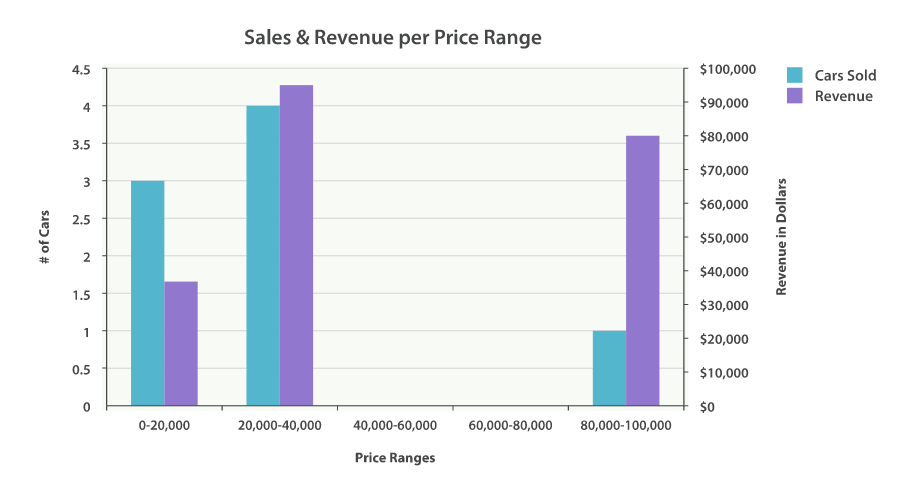
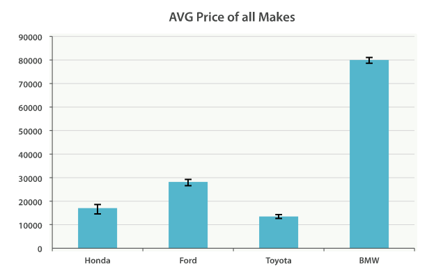
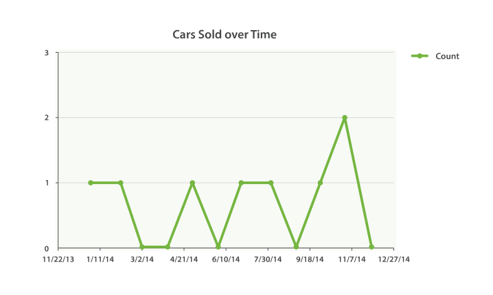
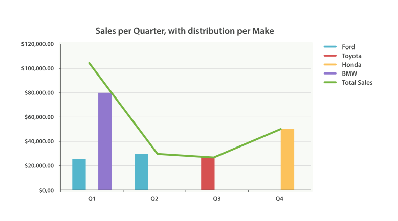
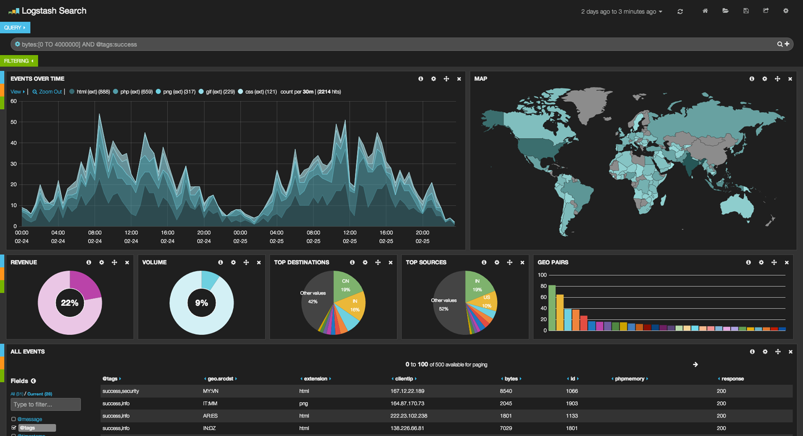

# 聚合


在这之前，本书致力于搜索。 通过搜索，如果我们有一个查询并且希望找到匹配这个查询的文档集，就好比在大海捞针。

通过聚合，我们会得到一个数据的概览。我们需要的是分析和总结全套的数据而不是寻找单个文档：

- 在大海里有多少针？
- 针的平均长度是多少？
- 按照针的制造商来划分，针的长度中位值是多少？
- 每月加入到海中的针有多少？

聚合也可以回答更加细微的问题：

- 你最受欢迎的针的制造商是什么？
- 这里面有异常的针么？

聚合允许我们向数据提出一些复杂的问题。虽然功能完全不同于搜索，但它使用相同的数据结构。这意味着聚合的执行速度很快并且就像搜索一样几乎是实时的。

这对报告和仪表盘是非常强大的。你可以实时显示你的数据，让你立即回应，而不是对你的数据进行汇总（ *需要一周时间去运行的 Hadoop 任务* ），您的报告随着你的数据变化而变化，而不是预先计算的、过时的和不相关的。

最后，聚合和搜索是一起的。 这意味着你可以在单个请求里同时对相同的数据进行搜索/过滤和分析。并且由于聚合是在用户搜索的上下文里计算的，你不只是显示四星酒店的数量，而是显示匹配查询条件的四星酒店的数量。

聚合是如此强大以至于许多公司已经专门为数据分析建立了大型 Elasticsearch 集群。


## 高阶概念

类似于 DSL 查询表达式， 聚合也有 *可组合* 的语法：独立单元的功能可以被混合起来提供你需要的自定义行为。这意味着只需要学习很少的基本概念，就可以得到几乎无尽的组合。

要掌握聚合，你只需要明白两个主要的概念：

- *桶（Buckets）*

  满足特定条件的文档的集合

- *指标（Metrics）*

  对桶内的文档进行统计计算

这就是全部了！每个聚合都是一个或者多个桶和零个或者多个指标的组合。翻译成粗略的SQL语句来解释吧：

```sql
SELECT COUNT(color)             <1>
FROM table
GROUP BY color                  <2>
```
>     `COUNT(color)` 相当于指标。   
>  
>     `GROUP BY color` 相当于桶。   

桶在概念上类似于 SQL 的分组（GROUP BY），而指标则类似于 `COUNT()` 、 `SUM()` 、 `MAX()` 等统计方法。

让我们深入这两个概念 并且了解和这两个概念相关的东西。


### 桶

*桶* 简单来说就是满足特定条件的文档的集合：

- 一个雇员属于 *男性* 桶或者 *女性* 桶
- 奥尔巴尼属于 *纽约* 桶
- 日期2014-10-28属于 *十月* 桶

当聚合开始被执行，每个文档里面的值通过计算来决定符合哪个桶的条件。如果匹配到，文档将放入相应的桶并接着进行聚合操作。

桶也可以被嵌套在其他桶里面，提供层次化的或者有条件的划分方案。例如，辛辛那提会被放入俄亥俄州这个桶，而 *整个* 俄亥俄州桶会被放入美国这个桶。

Elasticsearch 有很多种类型的桶，能让你通过很多种方式来划分文档（时间、最受欢迎的词、年龄区间、地理位置等等）。其实根本上都是通过同样的原理进行操作：基于条件来划分文档。


### 指标

桶能让我们划分文档到有意义的集合， 但是最终我们需要的是对这些桶内的文档进行一些指标的计算。分桶是一种达到目的的手段：它提供了一种给文档分组的方法来让我们可以计算感兴趣的指标。

大多数 *指标* 是简单的数学运算（例如最小值、平均值、最大值，还有汇总），这些是通过文档的值来计算。在实践中，指标能让你计算像平均薪资、最高出售价格、95%的查询延迟这样的数据。


### 桶和指标的组合

*聚合* 是由桶和指标组成的。 聚合可能只有一个桶，可能只有一个指标，或者可能两个都有。也有可能有一些桶嵌套在其他桶里面。例如，我们可以通过所属国家来划分文档（桶），然后计算每个国家的平均薪酬（指标）。

由于桶可以被嵌套，我们可以实现非常多并且非常复杂的聚合：

1.通过国家划分文档（桶）

2.然后通过性别划分每个国家（桶）

3.然后通过年龄区间划分每种性别（桶）

4.最后，为每个年龄区间计算平均薪酬（指标）

最后将告诉你每个 `<国家, 性别, 年龄>` 组合的平均薪酬。所有的这些都在一个请求内完成并且只遍历一次数据！


## 尝试聚合

我们可以用以下几页定义不同的聚合和它们的语法， 但学习聚合的最佳途径就是用实例来说明。 一旦我们获得了聚合的思想，以及如何合理地嵌套使用它们，那么语法就变得不那么重要了。
>    聚合的桶操作和度量的完整用法可以在 [Elasticsearch 参考](https://www.elastic.co/guide/en/elasticsearch/reference/5.6/search-aggregations.html) 中找到。本章中会涵盖其中很多内容，但在阅读完本章后查看它会有助于我们对它的整体能力有所了解。  

所以让我们先看一个例子。我们将会创建一些对汽车经销商有用的聚合，数据是关于汽车交易的信息：车型、制造商、售价、何时被出售等。

首先我们批量索引一些数据：

```js
POST /cars/transactions/_bulk
{ "index": {}}
{ "price" : 10000, "color" : "red", "make" : "honda", "sold" : "2014-10-28" }
{ "index": {}}
{ "price" : 20000, "color" : "red", "make" : "honda", "sold" : "2014-11-05" }
{ "index": {}}
{ "price" : 30000, "color" : "green", "make" : "ford", "sold" : "2014-05-18" }
{ "index": {}}
{ "price" : 15000, "color" : "blue", "make" : "toyota", "sold" : "2014-07-02" }
{ "index": {}}
{ "price" : 12000, "color" : "green", "make" : "toyota", "sold" : "2014-08-19" }
{ "index": {}}
{ "price" : 20000, "color" : "red", "make" : "honda", "sold" : "2014-11-05" }
{ "index": {}}
{ "price" : 80000, "color" : "red", "make" : "bmw", "sold" : "2014-01-01" }
{ "index": {}}
{ "price" : 25000, "color" : "blue", "make" : "ford", "sold" : "2014-02-12" }
```

有了数据，开始构建我们的第一个聚合。汽车经销商可能会想知道哪个颜色的汽车销量最好，用聚合可以轻易得到结果，用 `terms` 桶操作：

```js
GET /cars/transactions/_search
{
    "size" : 0,
    "aggs" : {                       <1>
        "popular_colors" : {         <2>
            "terms" : {              <3>
              "field" : "color"
            }
        }
    }
}
```
>    聚合操作被置于顶层参数 `aggs` 之下（如果你愿意，完整形式 `aggregations` 同样有效）。  
>  
>    然后，可以为聚合指定一个我们想要名称，本例中是： `popular_colors` 。   
>  
>    最后，定义单个桶的类型 `terms` 。   

聚合是在特定搜索结果背景下执行的， 这也就是说它只是查询请求的另外一个顶层参数（例如，使用 `/_search` 端点）。 聚合可以与查询结对，但我们会晚些在 [限定聚合的范围（Scoping Aggregations）](https://www.elastic.co/guide/cn/elasticsearch/guide/current/_scoping_aggregations.html) 中来解决这个问题。
>    可能会注意到我们将 `size` 设置成 0 。我们并不关心搜索结果的具体内容，所以将返回记录数设置为 0 来提高查询速度。 设置 `size: 0` 与 Elasticsearch 1.x 中使用 `count` 搜索类型等价。  

然后我们为聚合定义一个名字，名字的选择取决于使用者，响应的结果会以我们定义的名字为标签，这样应用就可以解析得到的结果。

随后我们定义聚合本身，在本例中，我们定义了一个单 `terms` 桶。 这个 `terms` 桶会为每个碰到的唯一词项动态创建新的桶。 因为我们告诉它使用 `color` 字段，所以 `terms` 桶会为每个颜色动态创建新桶。

让我们运行聚合并查看结果：

```js
{
...
   "hits": {
      "hits": []                   <1>
   },
   "aggregations": {
      "popular_colors": {          <2>
         "buckets": [
            {
               "key": "red",       <3>
               "doc_count": 4      <4>
            },
            {
               "key": "blue",
               "doc_count": 2
            },
            {
               "key": "green",
               "doc_count": 2
            }
         ]
      }
   }
}
```
>    因为我们设置了 `size` 参数，所以不会有 hits 搜索结果返回。  
>  
>  `popular_colors` 聚合是作为 `aggregations` 字段的一部分被返回的。  
>
>    每个桶的 `key` 都与 `color` 字段里找到的唯一词对应。它总会包含 `doc_count` 字段，告诉我们包含该词项的文档数量。  
>  
>    每个桶的数量代表该颜色的文档数量。  

响应包含多个桶，每个对应一个唯一颜色（例如：红 或 绿）。每个桶也包括 `聚合进` 该桶的所有文档的数量。例如，有四辆红色的车。

前面的这个例子完全是实时执行的：一旦文档可以被搜到，它就能被聚合。这也就意味着我们可以直接将聚合的结果源源不断的传入图形库，然后生成实时的仪表盘。 不久，你又销售了一辆银色的车，我们的图形就会立即动态更新银色车的统计信息。

瞧！这就是我们的第一个聚合！


### 添加度量指标

前面的例子告诉我们每个桶里面的文档数量，这很有用。 但通常，我们的应用需要提供更复杂的文档度量。 例如，每种颜色汽车的平均价格是多少？

为了获取更多信息，我们需要告诉 Elasticsearch 使用哪个字段，计算何种度量。 这需要将度量 *嵌套* 在桶内， 度量会基于桶内的文档计算统计结果。

让我们继续为汽车的例子加入 `average` 平均度量：

```js
GET /cars/transactions/_search
{
   "size" : 0,
   "aggs": {
      "colors": {
         "terms": {
            "field": "color"
         },
         "aggs": {                    <1>
            "avg_price": {            <2>
               "avg": {
                  "field": "price"    <3>
               }
            }
         }
      }
   }
}
```
>    为度量新增 `aggs` 层。  
>  
>    为度量指定名字： `avg_price` 。    
>  
>    最后，为 `price` 字段定义 `avg` 度量。  

正如所见，我们用前面的例子加入了新的 `aggs` 层。这个新的聚合层让我们可以将 `avg` 度量嵌套置于 `terms` 桶内。实际上，这就为每个颜色生成了平均价格。

正如 `颜色` 的例子，我们需要给度量起一个名字（ `avg_price` ）这样可以稍后根据名字获取它的值。最后，我们指定度量本身（ `avg` ）以及我们想要计算平均值的字段（ `price` ）：

```js
{
...
   "aggregations": {
      "colors": {
         "buckets": [
            {
               "key": "red",
               "doc_count": 4,
               "avg_price": {           <1>
                  "value": 32500
               }
            },
            {
               "key": "blue",
               "doc_count": 2,
               "avg_price": {
                  "value": 20000
               }
            },
            {
               "key": "green",
               "doc_count": 2,
               "avg_price": {
                  "value": 21000
               }
            }
         ]
      }
   }
...
}
```
>    响应中的新字段 `avg_price` 。   

尽管响应只发生很小改变，实际上我们获得的数据是增长了。之前，我们知道有四辆红色的车，现在，红色车的平均价格是 $32，500 美元。这个信息可以直接显示在报表或者图形中。


### 嵌套桶

在我们使用不同的嵌套方案时，聚合的力量才能真正得以显现。 在前例中，我们已经看到如何将一个度量嵌入桶中，它的功能已经十分强大了。

但真正令人激动的分析来自于将桶嵌套进 *另外一个桶* 所能得到的结果。 现在，我们想知道每个颜色的汽车制造商的分布：

```js
GET /cars/transactions/_search
{
   "size" : 0,
   "aggs": {
      "colors": {
         "terms": {
            "field": "color"
         },
         "aggs": {
            "avg_price": {               <1>
               "avg": {
                  "field": "price"
               }
            },
            "make": {                    <2>
                "terms": {
                    "field": "make"      <3>
                }
            }
         }
      }
   }
}
```
>    注意前例中的 `avg_price` 度量仍然保持原位。  
>  
>    另一个聚合 `make` 被加入到了 `color` 颜色桶中。  
>  
>    这个聚合是 `terms` 桶，它会为每个汽车制造商生成唯一的桶。  

这里发生了一些有趣的事。 首先，我们可能会观察到之前例子中的 `avg_price` 度量完全没有变化，还在原来的位置。 一个聚合的每个 *层级* 都可以有多个度量或桶， `avg_price` 度量告诉我们每种颜色汽车的平均价格。它与其他的桶和度量相互独立。

这对我们的应用非常重要，因为这里面有很多相互关联，但又完全不同的度量需要收集。聚合使我们能够用一次数据请求获得所有的这些信息。

另外一件值得注意的重要事情是我们新增的这个 `make` 聚合，它是一个 `terms` 桶（嵌套在 `colors` 、 `terms` 桶内）。这意味着它 会为数据集中的每个唯一组合生成（ `color` 、 `make` ）元组。

让我们看看返回的响应（为了简单我们只显示部分结果）：

```js
{
...
   "aggregations": {
      "colors": {
         "buckets": [
            {
               "key": "red",
               "doc_count": 4,
               "make": {                       <1>
                  "buckets": [
                     {
                        "key": "honda",        <2>
                        "doc_count": 3
                     },
                     {
                        "key": "bmw",
                        "doc_count": 1
                     }
                  ]
               },
               "avg_price": {
                  "value": 32500               <3>
               }
            },

...
}
```
>    正如期望的那样，新的聚合嵌入在每个颜色桶中。  
>  
>    现在我们看见按不同制造商分解的每种颜色下车辆信息。  
>  
>    最终，我们看到前例中的 `avg_price` 度量仍然维持不变。  

响应结果告诉我们以下几点：

- 红色车有四辆。
- 红色车的平均售价是 $32，500 美元。
- 其中三辆是 Honda 本田制造，一辆是 BMW 宝马制造。


### 最后的修改

让我们回到话题的原点，在进入新话题之前，对我们的示例做最后一个修改， 为每个汽车生成商计算最低和最高的价格：

```js
GET /cars/transactions/_search
{
   "size" : 0,
   "aggs": {
      "colors": {
         "terms": {
            "field": "color"
         },
         "aggs": {
            "avg_price": { "avg": { "field": "price" }
            },
            "make" : {
                "terms" : {
                    "field" : "make"
                },
                "aggs" : {                                           <1>
                    "min_price" : { "min": { "field": "price"} },    <2>
                    "max_price" : { "max": { "field": "price"} }     <3>
                }
            }
         }
      }
   }
}
```
>    我们需要增加另外一个嵌套的 `aggs` 层级。  
>  
>    然后包括 `min` 最小度量。  
>  
>    以及 `max` 最大度量。  

得到以下输出（只显示部分结果）：

```js
{
...
   "aggregations": {
      "colors": {
         "buckets": [
            {
               "key": "red",
               "doc_count": 4,
               "make": {
                  "buckets": [
                     {
                        "key": "honda",
                        "doc_count": 3,
                        "min_price": {
                           "value": 10000     <1>
                        },
                        "max_price": {
                           "value": 20000     <2>
                        }
                     },
                     {
                        "key": "bmw",
                        "doc_count": 1,
                        "min_price": {
                           "value": 80000
                        },
                        "max_price": {
                           "value": 80000
                        }
                     }
                  ]
               },
               "avg_price": {
                  "value": 32500
               }
            },
...
```
>      `min` 和 `max` 度量现在出现在每个汽车制造商（ `make` ）下面。   

有了这两个桶，我们可以对查询的结果进行扩展并得到以下信息：

- 有四辆红色车。
- 红色车的平均售价是 $32，500 美元。
- 其中三辆红色车是 Honda 本田制造，一辆是 BMW 宝马制造。
- 最便宜的红色本田售价为 $10，000 美元。
- 最贵的红色本田售价为 $20，000 美元。


## 条形图

聚合还有一个令人激动的特性就是能够十分容易地将它们转换成图表和图形。 本章中， 我们正在通过示例数据来完成各种各样的聚合分析，最终，我们将会发现聚合功能是非常强大的。

直方图 `histogram` 特别有用。 它本质上是一个条形图，如果有创建报表或分析仪表盘的经验，那么我们会毫无疑问的发现里面有一些图表是条形图。 创建直方图需要指定一个区间，如果我们要为售价创建一个直方图，可以将间隔设为 20,000。这样做将会在每个 $20,000 档创建一个新桶，然后文档会被分到对应的桶中。

对于仪表盘来说，我们希望知道每个售价区间内汽车的销量。我们还会想知道每个售价区间内汽车所带来的收入，可以通过对每个区间内已售汽车的售价求和得到。

可以用 `histogram` 和一个嵌套的 `sum` 度量得到我们想要的答案：

```js
GET /cars/transactions/_search
{
   "size" : 0,
   "aggs":{
      "price":{
         "histogram":{                   <1>
            "field": "price",
            "interval": 20000
         },
         "aggs":{
            "revenue": { 
               "sum": {                  <2>
                 "field" : "price"
               }
             }
         }
      }
   }
}
```
>    `histogram` 桶要求两个参数：一个数值字段以及一个定义桶大小间隔。   
>  
>    `sum` 度量嵌套在每个售价区间内，用来显示每个区间内的总收入。  

如我们所见，查询是围绕 `price` 聚合构建的，它包含一个 `histogram` 桶。它要求字段的类型必须是数值型的同时需要设定分组的间隔范围。 间隔设置为 20,000 意味着我们将会得到如 `[0-19999, 20000-39999, ...]` 这样的区间。

接着，我们在直方图内定义嵌套的度量，这个 `sum` 度量，它会对落入某一具体售价区间的文档中 `price` 字段的值进行求和。 这可以为我们提供每个售价区间的收入，从而可以发现到底是普通家用车赚钱还是奢侈车赚钱。

响应结果如下：

```js
{
...
   "aggregations": {
      "price": {
         "buckets": [
            {
               "key": 0,
               "doc_count": 3,
               "revenue": {
                  "value": 37000
               }
            },
            {
               "key": 20000,
               "doc_count": 4,
               "revenue": {
                  "value": 95000
               }
            },
            {
               "key": 80000,
               "doc_count": 1,
               "revenue": {
                  "value": 80000
               }
            }
         ]
      }
   }
}
```

结果很容易理解，不过应该注意到直方图的键值是区间的下限。键 `0` 代表区间 `0-19，999` ，键 `20000` 代表区间 `20，000-39，999` ，等等。
>    我们可能会注意到空的区间，比如：$40，000-60，000，没有出现在响应中。 `histogram`桶默认会忽略它，因为它有可能会导致不希望的潜在错误输出。  

我们会在下一小节中讨论如何包括空桶。返回空桶 [返回空 Buckets](https://www.elastic.co/guide/cn/elasticsearch/guide/current/_returning_empty_buckets.html) 。

可以在图 [图 35 “Sales and Revenue per price bracket”](https://www.elastic.co/guide/cn/elasticsearch/guide/current/_building_bar_charts.html#barcharts-histo1) 中看到以上数据直方图的图形化表示。

**图 35. Sales and Revenue per price bracket**



当然，我们可以为任何聚合输出的分类和统计结果创建条形图，而不只是 `直方图` 桶。让我们以最受欢迎 10 种汽车以及它们的平均售价、标准差这些信息创建一个条形图。 我们会用到 `terms` 桶和 `extended_stats` 度量：

```js
GET /cars/transactions/_search
{
  "size" : 0,
  "aggs": {
    "makes": {
      "terms": {
        "field": "make",
        "size": 10
      },
      "aggs": {
        "stats": {
          "extended_stats": {
            "field": "price"
          }
        }
      }
    }
  }
}
```

上述代码会按受欢迎度返回制造商列表以及它们各自的统计信息。我们对其中的 `stats.avg` 、 `stats.count` 和 `stats.std_deviation` 信息特别感兴趣，并用 它们计算出标准差：

```
std_err = std_deviation / count
```


创建图表如图 [图 36 “Average price of all makes, with error bars”](https://www.elastic.co/guide/cn/elasticsearch/guide/current/_building_bar_charts.html#barcharts-bar1) 。

**图 36. Average price of all makes, with error bars**




## 按时间统计

如果搜索是在 Elasticsearch 中使用频率最高的，那么构建按时间统计的 date_histogram 紧随其后。 为什么你会想用 date_histogram 呢？

假设你的数据带时间戳。 无论是什么数据（Apache 事件日志、股票买卖交易时间、棒球运动时间）只要带有时间戳都可以进行 date_histogram 分析。当你的数据有时间戳，你总是想在 *时间* 维度上构建指标分析：

- 今年每月销售多少台汽车？
- 这只股票最近 12 小时的价格是多少？
- 我们网站上周每小时的平均响应延迟时间是多少？

虽然通常的 histogram 都是条形图，但 date_histogram 倾向于转换成线状图以展示时间序列。 许多公司用 Elasticsearch _仅仅_ 只是为了分析时间序列数据。 `date_histogram` 分析是它们最基本的需要。

`date_histogram` 与 通常的 `histogram` 类似。 但不是在代表数值范围的数值字段上构建 buckets，而是在时间范围上构建 buckets。 因此每一个 bucket 都被定义成一个特定的日期大小 (比如， `1个月` 或 `2.5 天`)。

----
>  
>  **可以用通常的 histogram 进行时间分析吗？**
>  
>  从技术上来讲，是可以的。 通常的 `histogram` bucket（桶）是可以处理日期的。 但是它不能自动识别日期。 而用 `date_histogram` ，你可以指定时间段如 `1 个月` ，它能聪明地知道 2 月的天数比 12 月少。 `date_histogram` 还具有另外一个优势，即能合理地处理时区，这可以使你用客户端的时区进行图标定制，而不是用服务器端时区。
>  
>  通常的 histogram 会把日期看做是数字，这意味着你必须以微秒为单位指明时间间隔。另外聚合并不知道日历时间间隔，使得它对于日期而言几乎没什么用处。
>  
----

我们的第一个例子将构建一个简单的折线图来回答如下问题： 每月销售多少台汽车？

```js
GET /cars/transactions/_search
{
   "size" : 0,
   "aggs": {
      "sales": {
         "date_histogram": {
            "field": "sold",
            "interval": "month",      <1>
            "format": "yyyy-MM-dd"    <2>
         }
      }
   }
}
```
>    时间间隔要求是日历术语 (如每个 bucket 1 个月)。  
>  
>    我们提供日期格式以便 buckets 的键值便于阅读。  

我们的查询只有一个聚合，每月构建一个 bucket。这样我们可以得到每个月销售的汽车数量。 另外还提供了一个额外的 `format` 参数以便 buckets 有 "好看的" 键值。 然而在内部，日期仍然是被简单表示成数值。这可能会使得 UI 设计者抱怨，因此可以提供常用的日期格式进行格式化以更方便阅读。

结果既符合预期又有一点出人意料（看看你是否能找到意外之处）：

```js
{
   ...
   "aggregations": {
      "sales": {
         "buckets": [
            {
               "key_as_string": "2014-01-01",
               "key": 1388534400000,
               "doc_count": 1
            },
            {
               "key_as_string": "2014-02-01",
               "key": 1391212800000,
               "doc_count": 1
            },
            {
               "key_as_string": "2014-05-01",
               "key": 1398902400000,
               "doc_count": 1
            },
            {
               "key_as_string": "2014-07-01",
               "key": 1404172800000,
               "doc_count": 1
            },
            {
               "key_as_string": "2014-08-01",
               "key": 1406851200000,
               "doc_count": 1
            },
            {
               "key_as_string": "2014-10-01",
               "key": 1412121600000,
               "doc_count": 1
            },
            {
               "key_as_string": "2014-11-01",
               "key": 1414800000000,
               "doc_count": 2
            }
         ]
...
}
```

聚合结果已经完全展示了。正如你所见，我们有代表月份的 buckets，每个月的文档数目，以及美化后的 `key_as_string` 。


### 返回空 Buckets  {#返回空Buckets}

注意到结果末尾处的奇怪之处了吗？

是的，结果没错。 我们的结果少了一些月份！ `date_histogram` （和 `histogram` 一样）默认只会返回文档数目非零的 buckets。

这意味着你的 histogram 总是返回最少结果。通常，你并不想要这样。对于很多应用，你可能想直接把结果导入到图形库中，而不想做任何后期加工。

事实上，即使 buckets 中没有文档我们也想返回。可以通过设置两个额外参数来实现这种效果：

```js
GET /cars/transactions/_search
{
   "size" : 0,
   "aggs": {
      "sales": {
         "date_histogram": {
            "field": "sold",
            "interval": "month",
            "format": "yyyy-MM-dd",
            "min_doc_count" : 0,           <1>
            "extended_bounds" : {          <2> 
                "min" : "2014-01-01",
                "max" : "2014-12-31"
            }
         }
      }
   }
}
```
>    这个参数强制返回空 buckets。   
>  
>    这个参数强制返回整年。   

这两个参数会强制返回一年中所有月份的结果，而不考虑结果中的文档数目。 `min_doc_count` 非常容易理解：它强制返回所有 buckets，即使 buckets 可能为空。

`extended_bounds` 参数需要一点解释。 `min_doc_count` 参数强制返回空 buckets，但是 Elasticsearch 默认只返回你的数据中最小值和最大值之间的 buckets。

因此如果你的数据只落在了 4 月和 7 月之间，那么你只能得到这些月份的 buckets（可能为空也可能不为空）。因此为了得到全年数据，我们需要告诉 Elasticsearch 我们想要全部 buckets， 即便那些 buckets 可能落在最小日期 *之前* 或 最大日期 *之后* 。

`extended_bounds` 参数正是如此。一旦你加上了这两个设置，你可以把得到的结果轻易地直接插入到你的图形库中，从而得到类似 [图 37 “汽车销售时间图”](https://www.elastic.co/guide/cn/elasticsearch/guide/current/_returning_empty_buckets.html#date-histo-ts1) 的图表。

**图 37. 汽车销售时间图**



### 扩展例子

正如我们已经见过很多次，buckets 可以嵌套进 buckets 中从而得到更复杂的分析。 作为例子，我们构建聚合以便按季度展示所有汽车品牌总销售额。同时按季度、按每个汽车品牌计算销售总额，以便可以找出哪种品牌最赚钱：

```js
GET /cars/transactions/_search
{
   "size" : 0,
   "aggs": {
      "sales": {
         "date_histogram": {
            "field": "sold",
            "interval": "quarter",                 <1>
            "format": "yyyy-MM-dd",
            "min_doc_count" : 0,
            "extended_bounds" : {
                "min" : "2014-01-01",
                "max" : "2014-12-31"
            }
         },
         "aggs": {
            "per_make_sum": {
               "terms": {
                  "field": "make"
               },
               "aggs": {
                  "sum_price": {
                     "sum": { "field": "price" }   <2>
                  }
               }
            },
            "total_sum": {
               "sum": { "field": "price" }         <3>
            }
         }
      }
   }
}
```
>    注意我们把时间间隔从 `month` 改成了 `quarter` 。   
>  
>    计算每种品牌的总销售金额。   
>  
>    也计算所有全部品牌的汇总销售金额。       

得到的结果（截去了一大部分）如下：

```js
{
....
"aggregations": {
   "sales": {
      "buckets": [
         {
            "key_as_string": "2014-01-01",
            "key": 1388534400000,
            "doc_count": 2,
            "total_sum": {
               "value": 105000
            },
            "per_make_sum": {
               "buckets": [
                  {
                     "key": "bmw",
                     "doc_count": 1,
                     "sum_price": {
                        "value": 80000
                     }
                  },
                  {
                     "key": "ford",
                     "doc_count": 1,
                     "sum_price": {
                        "value": 25000
                     }
                  }
               ]
            }
         },
...
}
```

我们把结果绘成图，得到如 [图 38 “按品牌分布的每季度销售额”](https://www.elastic.co/guide/cn/elasticsearch/guide/current/_extended_example.html#date-histo-ts2) 所示的总销售额的折线图和每个品牌（每季度）的柱状图。

**图 38. 按品牌分布的每季度销售额**




### 潜力无穷

这些很明显都是简单例子，但图表聚合其实是潜力无穷的。 如 [图 39 “Kibana--用聚合构建的实时分析面板”](https://www.elastic.co/guide/cn/elasticsearch/guide/current/_the_sky_8217_s_the_limit.html#kibana-img)展示了 Kibana 中用各种聚合构建的面板。

**图 39. Kibana--用聚合构建的实时分析面板**



因为聚合的实时性，类似这样的面板很容易查询、操作和交互。这使得它们成为需要分析数据又不会构建 Hadoop 作业的非技术人员的理想工具。

当然，为了构建类似 Kibana 这样的强大面板，你可能需要更深的知识，比如基于范围、过滤以及排序的聚合。


## 范围限定的聚合

所有聚合的例子到目前为止，你可能已经注意到，我们的搜索请求省略了一个 `query` 。 整个请求只不过是一个聚合。

聚合可以与搜索请求同时执行，但是我们需要理解一个新概念： *范围* 。 默认情况下，聚合与查询是对同一范围进行操作的，也就是说，聚合是基于我们查询匹配的文档集合进行计算的。

让我们看看第一个聚合的示例：

```js
GET /cars/transactions/_search
{
    "size" : 0,
    "aggs" : {
        "colors" : {
            "terms" : {
              "field" : "color"
            }
        }
    }
}
```

我们可以看到聚合是隔离的。现实中，Elasticsearch 认为 "没有指定查询" 和 "查询所有文档" 是等价的。前面这个查询内部会转化成下面的这个请求：

```js
GET /cars/transactions/_search
{
    "size" : 0,
    "query" : {
        "match_all" : {}
    },
    "aggs" : {
        "colors" : {
            "terms" : {
              "field" : "color"
            }
        }
    }
}
```

因为聚合总是对查询范围内的结果进行操作的，所以一个隔离的聚合实际上是在对 `match_all` 的结果范围操作，即所有的文档。

一旦有了范围的概念，我们就能更进一步对聚合进行自定义。我们前面所有的示例都是对 *所有* 数据计算统计信息的：销量最高的汽车，所有汽车的平均售价，最佳销售月份等等。

利用范围，我们可以问“福特在售车有多少种颜色？”诸如此类的问题。可以简单的在请求中加上一个查询（本例中为 `match` 查询）：

```js
GET /cars/transactions/_search
{
    "query" : {
        "match" : {
            "make" : "ford"
        }
    },
    "aggs" : {
        "colors" : {
            "terms" : {
              "field" : "color"
            }
        }
    }
}
```

因为我们没有指定 `"size" : 0` ，所以搜索结果和聚合结果都被返回了：

```js
{
...
   "hits": {
      "total": 2,
      "max_score": 1.6931472,
      "hits": [
         {
            "_source": {
               "price": 25000,
               "color": "blue",
               "make": "ford",
               "sold": "2014-02-12"
            }
         },
         {
            "_source": {
               "price": 30000,
               "color": "green",
               "make": "ford",
               "sold": "2014-05-18"
            }
         }
      ]
   },
   "aggregations": {
      "colors": {
         "buckets": [
            {
               "key": "blue",
               "doc_count": 1
            },
            {
               "key": "green",
               "doc_count": 1
            }
         ]
      }
   }
}
```

看上去这并没有什么，但却对高大上的仪表盘来说至关重要。 加入一个搜索栏可以将任何静态的仪表板变成一个实时数据搜索设备。 这让用户可以搜索数据，查看所有实时更新的图形（由于聚合的支持以及对查询范围的限定）。 这是 Hadoop 无法做到的！


**全局桶**

通常我们希望聚合是在查询范围内的，但有时我们也想要搜索它的子集，而聚合的对象却是 *所有* 数据。

例如，比方说我们想知道福特汽车与 *所有* 汽车平均售价的比较。我们可以用普通的聚合（查询范围内的）得到第一个信息，然后用 `全局` 桶获得第二个信息。

`全局` 桶包含 *所有* 的文档，它无视查询的范围。因为它还是一个桶，我们可以像平常一样将聚合嵌套在内：

```js
GET /cars/transactions/_search
{
    "size" : 0,
    "query" : {
        "match" : {
            "make" : "ford"
        }
    },
    "aggs" : {
        "single_avg_price": {
            "avg" : { "field" : "price" }           <1>
        },
        "all": {
            "global" : {},                          <2>
            "aggs" : {
                "avg_price": {
                    "avg" : { "field" : "price" }   <3>
                }

            }
        }
    }
}
```
>    聚合操作在查询范围内（例如：所有文档匹配 `ford` ）  
>  
>    `global` 全局桶没有参数。  
>  
>    聚合操作针对所有文档，忽略汽车品牌。   

`single_avg_price` 度量计算是基于查询范围内所有文档，即所有 `福特` 汽车。`avg_price` 度量是嵌套在 `全局` 桶下的，这意味着它完全忽略了范围并对所有文档进行计算。聚合返回的平均值是所有汽车的平均售价。

如果能一直坚持读到这里，应该知道我们有个真言：尽可能的使用过滤器。它同样可以应用于聚合，在下一章中，我们会展示如何对聚合结果进行过滤而不是仅对查询范围做限定。


