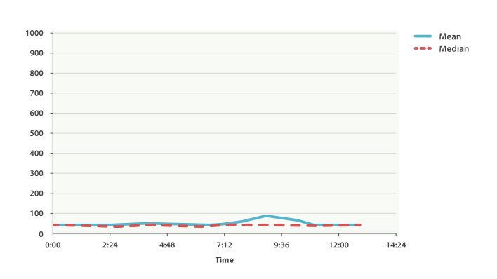
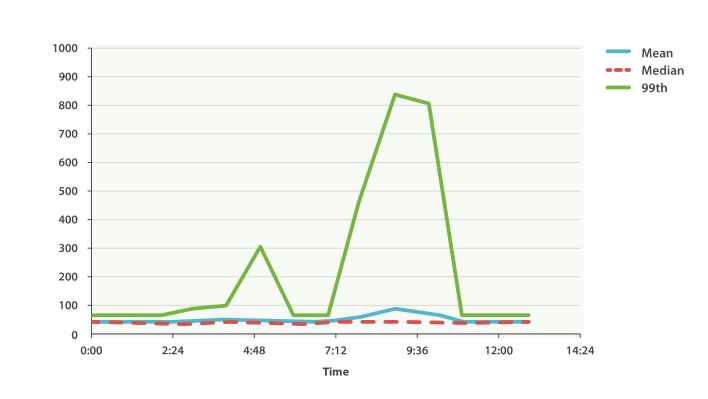

# 聚合


## 过滤和聚合

聚合范围限定还有一个自然的扩展就是过滤。因为聚合是在查询结果范围内操作的，任何可以适用于查询的过滤器也可以应用在聚合上。


### 过滤

如果我们想找到售价在 $10,000 美元之上的所有汽车同时也为这些车计算平均售价， 可以简单地使用一个 `constant_score` 查询和 `filter` 约束：

```js
GET /cars/transactions/_search
{
    "size" : 0,
    "query" : {
        "constant_score": {
            "filter": {
                "range": {
                    "price": {
                        "gte": 10000
                    }
                }
            }
        }
    },
    "aggs" : {
        "single_avg_price": {
            "avg" : { "field" : "price" }
        }
    }
}
```

这正如我们在前面章节中讨论过那样，从根本上讲，使用 `non-scoring` 查询和使用 `match` 查询没有任何区别。查询（包括了一个过滤器）返回一组文档的子集，聚合正是操作这些文档。使用 `filtering query` 会忽略评分，并有可能会缓存结果数据等等。


### 过滤桶

但是如果我们只想对聚合结果过滤怎么办？ 假设我们正在为汽车经销商创建一个搜索页面， 我们希望显示用户搜索的结果，但是我们同时也想在页面上提供更丰富的信息，包括（与搜索匹配的）上个月度汽车的平均售价。

这里我们无法简单的做范围限定，因为有两个不同的条件。搜索结果必须是 `ford` ，但是聚合结果必须满足 `ford` AND `sold > now - 1M` 。

为了解决这个问题，我们可以用一种特殊的桶，叫做 `filter` （注：过滤桶） 。 我们可以指定一个过滤桶，当文档满足过滤桶的条件时，我们将其加入到桶内。

查询结果如下：

```js
GET /cars/transactions/_search
{
   "size" : 0,
   "query":{
      "match": {
         "make": "ford"
      }
   },
   "aggs":{
      "recent_sales": {
         "filter": {                         <1>
            "range": {
               "sold": {
                  "from": "now-1M"
               }
            }
         },
         "aggs": {
            "average_price":{
               "avg": {
                  "field": "price"           <2>
               }
            }
         }
      }
   }
}
```
>    使用 `过滤` 桶在 `查询` 范围基础上应用过滤器。   
>  
>     `avg` 度量只会对 `ford` 和上个月售出的文档计算平均售价。  

因为 `filter` 桶和其他桶的操作方式一样，所以可以随意将其他桶和度量嵌入其中。所有嵌套的组件都会 "继承" 这个过滤，这使我们可以按需针对聚合过滤出选择部分。


### 后过滤器

目前为止，我们可以同时对搜索结果和聚合结果进行过滤（不计算得分的 `filter` 查询），以及针对聚合结果的一部分进行过滤（ `filter` 桶）。

我们可能会想，"只过滤搜索结果，不过滤聚合结果呢？" 答案是使用 `post_filter` 。

它是接收一个过滤器的顶层搜索请求元素。这个过滤器在查询 *之后* 执行（这正是该过滤器的名字的由来：它在查询之后 `post` 执行）。正因为它在查询之后执行，它对查询范围没有任何影响，所以对聚合也不会有任何影响。

我们可以利用这个行为对查询条件应用更多的过滤器，而不会影响其他的操作，就如 UI 上的各个分类面。让我们为汽车经销商设计另外一个搜索页面，这个页面允许用户搜索汽车同时可以根据颜色来过滤。颜色的选项是通过聚合获得的：

```js
GET /cars/transactions/_search
{
    "size" : 0,
    "query": {
        "match": {
            "make": "ford"
        }
    },
    "post_filter": {                              <1>
        "term" : {
            "color" : "green"
        }
    },
    "aggs" : {
        "all_colors": {
            "terms" : { "field" : "color" }
        }
    }
}
```
>    `post_filter` 元素是 `top-level` 而且仅对命中结果进行过滤。  

`查询` 部分找到所有的 `ford` 汽车，然后用 `terms` 聚合创建一个颜色列表。因为聚合对查询范围进行操作，颜色列表与福特汽车有的颜色相对应。

最后， `post_filter` 会过滤搜索结果，只展示绿色 `ford` 汽车。这在查询执行过 *后* 发生，所以聚合不受影响。

这通常对 UI 的连贯一致性很重要，可以想象用户在界面商选择了一类颜色（比如：绿色），期望的是搜索结果已经被过滤了，而 *不是* 过滤界面上的选项。如果我们应用 `filter` 查询，界面会马上变成 *只* 显示 `绿色` 作为选项，这不是用户想要的！
>    **性能考虑（Performance consideration）**  
>  当你需要对搜索结果和聚合结果做不同的过滤时，你才应该使用 `post_filter` ， 有时用户会在普通搜索使用 `post_filter` 。
>  
>  不要这么做！ `post_filter` 的特性是在查询 *之后* 执行，任何过滤对性能带来的好处（比如缓存）都会完全失去。
>  
>  在我们需要不同过滤时， `post_filter` 只与聚合一起使用。


### 小结  {#小结5_2}

选择合适类型的过滤（如：搜索命中、聚合或两者兼有）通常和我们期望如何表现用户交互有关。选择合适的过滤器（或组合）取决于我们期望如何将结果呈现给用户。

- 在 `filter` 过滤中的 `non-scoring` 查询，同时影响搜索结果和聚合结果。
- `filter` 桶影响聚合。
- `post_filter` 只影响搜索结果。


## 多桶排序

多值桶（ `terms` 、 `histogram` 和 `date_histogram` ）动态生成很多桶。 Elasticsearch 是如何决定这些桶展示给用户的顺序呢？

默认的，桶会根据 `doc_count` 降序排列。这是一个好的默认行为，因为通常我们想要找到文档中与查询条件相关的最大值：售价、人口数量、频率。但有些时候我们希望能修改这个顺序，不同的桶有着不同的处理方式。


### 内置排序

这些排序模式是桶 *固有的* 能力：它们操作桶生成的数据 ，比如 `doc_count` 。 它们共享相同的语法，但是根据使用桶的不同会有些细微差别。

让我们做一个 `terms` 聚合但是按 `doc_count` 值的升序排序：

```js
GET /cars/transactions/_search
{
    "size" : 0,
    "aggs" : {
        "colors" : {
            "terms" : {
              "field" : "color",
              "order": {
                "_count" : "asc"       <1>
              }
            }
        }
    }
}
```
>    用关键字 `_count` ，我们可以按 `doc_count` 值的升序排序。   

我们为聚合引入了一个 `order` 对象， 它允许我们可以根据以下几个值中的一个值进行排序：

- `_count`

  按文档数排序。对 `terms` 、 `histogram` 、 `date_histogram` 有效。

- `_term`

  按词项的字符串值的字母顺序排序。只在 `terms` 内使用。

- `_key`

  按每个桶的键值数值排序（理论上与 `_term` 类似）。 只在 `histogram` 和 `date_histogram` 内使用。


### 按度量排序

有时，我们会想基于度量计算的结果值进行排序。 在我们的汽车销售分析仪表盘中，我们可能想按照汽车颜色创建一个销售条状图表，但按照汽车平均售价的升序进行排序。

我们可以增加一个度量，再指定 `order` 参数引用这个度量即可：

```js
GET /cars/transactions/_search
{
    "size" : 0,
    "aggs" : {
        "colors" : {
            "terms" : {
              "field" : "color",
              "order": {
                "avg_price" : "asc"             <1>
              }
            },
            "aggs": {
                "avg_price": {
                    "avg": {"field": "price"}   <2>
                }
            }
        }
    }
}
```
>    桶按照计算平均值的升序排序。   
>  
>    计算每个桶的平均售价。     

我们可以采用这种方式用任何度量排序，只需简单的引用度量的名字。不过有些度量会输出多个值。 `extended_stats` 度量是一个很好的例子：它输出好几个度量值。

如果我们想使用多值度量进行排序， 我们只需以关心的度量为关键词使用点式路径：

```js
GET /cars/transactions/_search
{
    "size" : 0,
    "aggs" : {
        "colors" : {
            "terms" : {
              "field" : "color",
              "order": {
                "stats.variance" : "asc"                   <1>
              }
            },
            "aggs": {
                "stats": {
                    "extended_stats": {"field": "price"}
                }
            }
        }
    }
}
```
>    使用 `.` 符号，根据感兴趣的度量进行排序。  

在上面这个例子中，我们按每个桶的方差来排序，所以这种颜色售价方差最小的会排在结果集最前面。


### 基于“深度”度量排序  {#基于深度度量排序}

在前面的示例中，度量是桶的直接子节点。平均售价是根据每个 `term` 来计算的。 在一定条件下，我们也有可能对 *更深* 的度量进行排序，比如孙子桶或从孙桶。

我们可以定义更深的路径，将度量用尖括号（ `>` ）嵌套起来，像这样： `my_bucket>another_bucket>metric` 。

需要提醒的是嵌套路径上的每个桶都必须是 *单值* 的。 `filter` 桶生成 一个单值桶：所有与过滤条件匹配的文档都在桶中。 多值桶（如：`terms` ）动态生成许多桶，无法通过指定一个确定路径来识别。

目前，只有三个单值桶： `filter` 、 `global` 和 `reverse_nested` 。让我们快速用示例说明，创建一个汽车售价的直方图，但是按照红色和绿色（不包括蓝色）车各自的方差来排序：

```js
GET /cars/transactions/_search
{
    "size" : 0,
    "aggs" : {
        "colors" : {
            "histogram" : {
              "field" : "price",
              "interval": 20000,
              "order": {
                "red_green_cars>stats.variance" : "asc"                    <1>
              }
            },
            "aggs": {
                "red_green_cars": {
                    "filter": { "terms": {"color": ["red", "green"]}},     <2>
                    "aggs": {
                        "stats": {"extended_stats": {"field" : "price"}}   <3>
                    }
                }
            }
        }
    }
}
```
>    按照嵌套度量的方差对桶的直方图进行排序。  
>  
>    因为我们使用单值过滤器 `filter` ，我们可以使用嵌套排序。  
>  
>    按照生成的度量对统计结果进行排序。      

本例中，可以看到我们如何访问一个嵌套的度量。 `stats` 度量是 `red_green_cars` 聚合的子节点，而 `red_green_cars` 又是 `colors` 聚合的子节点。 为了根据这个度量排序，我们定义了路径 `red_green_cars>stats.variance` 。我们可以这么做，因为 `filter` 桶是个单值桶。


## 近似聚合

如果所有的数据都在一台机器上，那么生活会容易许多。 CS201 课上教的经典算法就足够应付这些问题。如果所有的数据都在一台机器上，那么也就不需要像 Elasticsearch 这样的分布式软件了。不过一旦我们开始分布式存储数据，就需要小心地选择算法。

有些算法可以分布执行，到目前为止讨论过的所有聚合都是单次请求获得精确结果的。这些类型的算法通常被认为是 *高度并行的* ，因为它们无须任何额外代价，就能在多台机器上并行执行。比如当计算 `max` 度量时，以下的算法就非常简单：

1. 把请求广播到所有分片。
2. 查看每个文档的 `price` 字段。如果 `price > current_max` ，将 `current_max` 替换成 `price` 。
3. 返回所有分片的最大 `price` 并传给协调节点。
4. 找到从所有分片返回的最大 `price` 。这是最终的最大值。

这个算法可以随着机器数的线性增长而横向扩展，无须任何协调操作（机器之间不需要讨论中间结果），而且内存消耗很小（一个整型就能代表最大值）。

不幸的是，不是所有的算法都像获取最大值这样简单。更加复杂的操作则需要在算法的性能和内存使用上做出权衡。对于这个问题，我们有个三角因子模型：大数据、精确性和实时性。

我们需要选择其中两项：

- 精确 + 实时

  数据可以存入单台机器的内存之中，我们可以随心所欲，使用任何想用的算法。结果会 100% 精确，响应会相对快速。

- 大数据 + 精确

  传统的 Hadoop。可以处理 PB 级的数据并且为我们提供精确的答案，但它可能需要几周的时间才能为我们提供这个答案。

- 大数据 + 实时

  近似算法为我们提供准确但不精确的结果。

Elasticsearch 目前支持两种近似算法（ `cardinality` 和 `percentiles` ）。 它们会提供准确但不是 100% 精确的结果。 以牺牲一点小小的估算错误为代价，这些算法可以为我们换来高速的执行效率和极小的内存消耗。

对于 *大多数* 应用领域，能够 *实时* 返回高度准确的结果要比 100% 精确结果重要得多。乍一看这可能是天方夜谭。有人会叫 *“我们需要精确的答案！”* 。但仔细考虑 0.5% 误差所带来的影响：

- 99% 的网站延时都在 132ms 以下。
- 0.5% 的误差对以上延时的影响在正负 0.66ms 。
- 近似计算的结果会在毫秒内返回，而“完全正确”的结果就可能需要几秒，甚至无法返回。

只要简单的查看网站的延时情况，难道我们会在意近似结果是 132.66ms 而不是 132ms 吗？当然，不是所有的领域都能容忍这种近似结果，但对于绝大多数来说是没有问题的。接受近似结果更多的是一种 *文化观念上* 的壁垒而不是商业或技术上的需要。


### 统计去重后的数量

Elasticsearch 提供的首个近似聚合是 `cardinality` （注：基数）度量。 它提供一个字段的基数，即该字段的 *distinct* 或者 *unique* 值的数目。 你可能会对 SQL 形式比较熟悉：

```sql
SELECT COUNT(DISTINCT color)
FROM cars
```

去重是一个很常见的操作，可以回答很多基本的业务问题：

- 网站独立访客是多少？
- 卖了多少种汽车？
- 每月有多少独立用户购买了商品？

我们可以用 `cardinality` 度量确定经销商销售汽车颜色的数量：

```js
GET /cars/transactions/_search
{
    "size" : 0,
    "aggs" : {
        "distinct_colors" : {
            "cardinality" : {
              "field" : "color"
            }
        }
    }
}
```

返回的结果表明已经售卖了三种不同颜色的汽车：

```js
...
"aggregations": {
  "distinct_colors": {
     "value": 3
  }
}
...
```

可以让我们的例子变得更有用：每月有多少颜色的车被售出？为了得到这个度量，我们只需要将一个 `cardinality` 度量嵌入一个 `date_histogram` ：

```js
GET /cars/transactions/_search
{
  "size" : 0,
  "aggs" : {
      "months" : {
        "date_histogram": {
          "field": "sold",
          "interval": "month"
        },
        "aggs": {
          "distinct_colors" : {
              "cardinality" : {
                "field" : "color"
              }
          }
        }
      }
  }
}
```


**学会权衡**

正如我们本章开头提到的， `cardinality` 度量是一个近似算法。 它是基于 [HyperLogLog++](http://static.googleusercontent.com/media/research.google.com/en//pubs/archive/40671.pdf) （HLL）算法的。 HLL 会先对我们的输入作哈希运算，然后根据哈希运算的结果中的 bits 做概率估算从而得到基数。

我们不需要理解技术细节（如果确实感兴趣，可以阅读这篇论文）， 但我们最好应该关注一下这个算法的 *特性* ：

- 可配置的精度，用来控制内存的使用（更精确 ＝ 更多内存）。
- 小的数据集精度是非常高的。
- 我们可以通过配置参数，来设置去重需要的固定内存使用量。无论数千还是数十亿的唯一值，内存使用量只与你配置的精确度相关。

要配置精度，我们必须指定 `precision_threshold` 参数的值。 这个阈值定义了在何种基数水平下我们希望得到一个近乎精确的结果。参考以下示例：

```js
GET /cars/transactions/_search
{
    "size" : 0,
    "aggs" : {
        "distinct_colors" : {
            "cardinality" : {
              "field" : "color",
              "precision_threshold" : 100             <1>
            }
        }
    }
}
```
>    `precision_threshold` 接受 0–40,000 之间的数字，更大的值还是会被当作 40,000 来处理。   

示例会确保当字段唯一值在 100 以内时会得到非常准确的结果。尽管算法是无法保证这点的，但如果基数在阈值以下，几乎总是 100% 正确的。高于阈值的基数会开始节省内存而牺牲准确度，同时也会对度量结果带入误差。

对于指定的阈值，HLL 的数据结构会大概使用 `precision_threshold * 8` 字节的内存，所以就必须在牺牲内存和获得额外的准确度间做平衡。

在实际应用中， `100` 的阈值可以在唯一值为百万的情况下仍然将误差维持 5% 以内。


**速度优化**

如果想要获得唯一值的数目， *通常* 需要查询整个数据集合（或几乎所有数据）。 所有基于所有数据的操作都必须迅速，原因是显然的。 HyperLogLog 的速度已经很快了，它只是简单的对数据做哈希以及一些位操作。

但如果速度对我们至关重要，可以做进一步的优化。 因为 HLL 只需要字段内容的哈希值，我们可以在索引时就预先计算好。 就能在查询时跳过哈希计算然后将哈希值从 fielddata 直接加载出来。
>    预先计算哈希值只对内容很长或者基数很高的字段有用，计算这些字段的哈希值的消耗在查询时是无法忽略的。  

尽管数值字段的哈希计算是非常快速的，存储它们的原始值通常需要同样（或更少）的内存空间。这对低基数的字符串字段同样适用，Elasticsearch 的内部优化能够保证每个唯一值只计算一次哈希。

基本上说，预先计算并不能保证所有的字段都更快，它只对那些具有高基数和/或者内容很长的字符串字段有作用。需要记住的是，预计算只是简单的将查询消耗的时间提前转移到索引时，并非没有任何代价，区别在于你可以选择在 *什么时候* 做这件事，要么在索引时，要么在查询时。

要想这么做，我们需要为数据增加一个新的多值字段。我们先删除索引，再增加一个包括哈希值字段的映射，然后重新索引：

```js
DELETE /cars/

PUT /cars/
{
  "mappings": {
    "transactions": {
      "properties": {
        "color": {
          "type": "string",
          "fields": {
            "hash": {
              "type": "murmur3"     <1>
            }
          }
        }
      }
    }
  }
}

POST /cars/transactions/_bulk
{ "index": {}}
{ "price" : 10000, "color" : "red", "make" : "honda", "sold" : "2014-10-28" }
{ "index": {}}
{ "price" : 20000, "color" : "red", "make" : "honda", "sold" : "2014-11-05" }
{ "index": {}}
{ "price" : 30000, "color" : "green", "make" : "ford", "sold" : "2014-05-18" }
{ "index": {}}
{ "price" : 15000, "color" : "blue", "make" : "toyota", "sold" : "2014-07-02" }
{ "index": {}}
{ "price" : 12000, "color" : "green", "make" : "toyota", "sold" : "2014-08-19" }
{ "index": {}}
{ "price" : 20000, "color" : "red", "make" : "honda", "sold" : "2014-11-05" }
{ "index": {}}
{ "price" : 80000, "color" : "red", "make" : "bmw", "sold" : "2014-01-01" }
{ "index": {}}
{ "price" : 25000, "color" : "blue", "make" : "ford", "sold" : "2014-02-12" }
```
>    多值字段的类型是 `murmur3` ，这是一个哈希函数。   

现在当我们执行聚合时，我们使用 `color.hash` 字段而不是 `color` 字段：

```js
GET /cars/transactions/_search
{
    "size" : 0,
    "aggs" : {
        "distinct_colors" : {
            "cardinality" : {
              "field" : "color.hash"      <1>
            }
        }
    }
}
```
>    注意我们指定的是哈希过的多值字段，而不是原始字段。   

现在 `cardinality` 度量会读取 `"color.hash"` 里的值（预先计算的哈希值），取代动态计算原始值的哈希。

单个文档节省的时间是非常少的，但是如果你聚合一亿数据，每个字段多花费 10 纳秒的时间，那么在每次查询时都会额外增加 1 秒，如果我们要在非常大量的数据里面使用 `cardinality` ，我们可以权衡使用预计算的意义，是否需要提前计算 hash，从而在查询时获得更好的性能，做一些性能测试来检验预计算哈希是否适用于你的应用场景。。


### 百分位计算

Elasticsearch 提供的另外一个近似度量就是 `percentiles` 百分位数度量。 百分位数展现某以具体百分比下观察到的数值。例如，第95个百分位上的数值，是高于 95% 的数据总和。

百分位数通常用来找出异常。在（统计学）的正态分布下，第 0.13 和 第 99.87 的百分位数代表与均值距离三倍标准差的值。任何处于三倍标准差之外的数据通常被认为是不寻常的，因为它与平均值相差太大。

更具体的说，假设我们正运行一个庞大的网站，一个很重要的工作是保证用户请求能得到快速响应，因此我们就需要监控网站的延时来判断响应是否能保证良好的用户体验。

在此场景下，一个常用的度量方法就是平均响应延时。 但这并不是一个好的选择（尽管很常用），因为平均数通常会隐藏那些异常值， 中位数有着同样的问题。 我们可以尝试最大值，但这个度量会轻而易举的被单个异常值破坏。

在图 [图 40 “Average request latency over time”](https://www.elastic.co/guide/cn/elasticsearch/guide/current/percentiles.html#percentile-mean-median) 查看问题。如果我们依靠如平均值或中位数这样的简单度量，就会得到像这样一幅图 [图 40 “Average request latency over time”](https://www.elastic.co/guide/cn/elasticsearch/guide/current/percentiles.html#percentile-mean-median) 。


**图 40. Average request latency over time**



一切正常。 图上有轻微的波动，但没有什么值得关注的。 但如果我们加载 99 百分位数时（这个值代表最慢的 1% 的延时），我们看到了完全不同的一幅画面，如图 [图 41 “Average request latency with 99th percentile over time”](https://www.elastic.co/guide/cn/elasticsearch/guide/current/percentiles.html#percentile-mean-median-percentile) 。


**图 41. Average request latency with 99th percentile over time**



令人吃惊！在上午九点半时，均值只有 75ms。如果作为一个系统管理员，我们都不会看他第二眼。 一切正常！但 99 百分位告诉我们有 1% 的用户碰到的延时超过 850ms，这是另外一幅场景。 在上午4点48时也有一个小波动，这甚至无法从平均值和中位数曲线上观察到。

这只是百分位的一个应用场景，百分位还可以被用来快速用肉眼观察数据的分布，检查是否有数据倾斜或双峰甚至更多。


**百分位度量**

让我加载一个新的数据集（汽车的数据不太适用于百分位）。我们要索引一系列网站延时数据然后运行一些百分位操作进行查看：

```js
POST /website/logs/_bulk
{ "index": {}}
{ "latency" : 100, "zone" : "US", "timestamp" : "2014-10-28" }
{ "index": {}}
{ "latency" : 80, "zone" : "US", "timestamp" : "2014-10-29" }
{ "index": {}}
{ "latency" : 99, "zone" : "US", "timestamp" : "2014-10-29" }
{ "index": {}}
{ "latency" : 102, "zone" : "US", "timestamp" : "2014-10-28" }
{ "index": {}}
{ "latency" : 75, "zone" : "US", "timestamp" : "2014-10-28" }
{ "index": {}}
{ "latency" : 82, "zone" : "US", "timestamp" : "2014-10-29" }
{ "index": {}}
{ "latency" : 100, "zone" : "EU", "timestamp" : "2014-10-28" }
{ "index": {}}
{ "latency" : 280, "zone" : "EU", "timestamp" : "2014-10-29" }
{ "index": {}}
{ "latency" : 155, "zone" : "EU", "timestamp" : "2014-10-29" }
{ "index": {}}
{ "latency" : 623, "zone" : "EU", "timestamp" : "2014-10-28" }
{ "index": {}}
{ "latency" : 380, "zone" : "EU", "timestamp" : "2014-10-28" }
{ "index": {}}
{ "latency" : 319, "zone" : "EU", "timestamp" : "2014-10-29" }
```

数据有三个值：延时、数据中心的区域以及时间戳。让我们对数据全集进行 *百分位* 操作以获得数据分布情况的直观感受：

```js
GET /website/logs/_search
{
    "size" : 0,
    "aggs" : {
        "load_times" : {
            "percentiles" : {
                "field" : "latency"      <1>
            }
        },
        "avg_load_time" : {
            "avg" : { 
                "field" : "latency"      <2>
            }
        }
    }
}
```
>     `percentiles` 度量被应用到 `latency` 延时字段。   
>  
>     为了比较，我们对相同字段使用 `avg` 度量。      

默认情况下，`percentiles` 度量会返回一组预定义的百分位数值： `[1, 5, 25, 50, 75, 95, 99]` 。它们表示了人们感兴趣的常用百分位数值，极端的百分位数在范围的两边，其他的一些处于中部。在返回的响应中，我们可以看到最小延时在 75ms 左右，而最大延时差不多有 600ms。与之形成对比的是，平均延时在 200ms 左右， 信息并不是很多：

```js
...
"aggregations": {
  "load_times": {
     "values": {
        "1.0": 75.55,
        "5.0": 77.75,
        "25.0": 94.75,
        "50.0": 101,
        "75.0": 289.75,
        "95.0": 489.34999999999985,
        "99.0": 596.2700000000002
     }
  },
  "avg_load_time": {
     "value": 199.58333333333334
  }
}
```

所以显然延时的分布很广，让我们看看它们是否与数据中心的地理区域有关：

```js
GET /website/logs/_search
{
    "size" : 0,
    "aggs" : {
        "zones" : {
            "terms" : { 
                "field" : "zone"                         <1>
            },
            "aggs" : {
                "load_times" : {
                    "percentiles" : {                    <2>
                      "field" : "latency",
                      "percents" : [50, 95.0, 99.0]      <3>
                    }
                },
                "load_avg" : {
                    "avg" : {
                        "field" : "latency"
                    }
                }
            }
        }
    }
}
```
>     首先根据区域我们将延时分到不同的桶中。       
>  
>     再计算每个区域的百分位数值。            
>  
>    `percents` 参数接受了我们想返回的一组百分位数，因为我们只对长的延时感兴趣。  

在响应结果中，我们发现欧洲区域（EU）要比美国区域（US）慢很多，在美国区域（US），50 百分位与 99 百分位十分接近，它们都接近均值。

与之形成对比的是，欧洲区域（EU）在 50 和 99 百分位有较大区分。现在，显然可以发现是欧洲区域（EU）拉低了延时的统计信息，我们知道欧洲区域的 50% 延时都在 300ms+。

```js
...
"aggregations": {
  "zones": {
     "buckets": [
        {
           "key": "eu",
           "doc_count": 6,
           "load_times": {
              "values": {
                 "50.0": 299.5,
                 "95.0": 562.25,
                 "99.0": 610.85
              }
           },
           "load_avg": {
              "value": 309.5
           }
        },
        {
           "key": "us",
           "doc_count": 6,
           "load_times": {
              "values": {
                 "50.0": 90.5,
                 "95.0": 101.5,
                 "99.0": 101.9
              }
           },
           "load_avg": {
              "value": 89.66666666666667
           }
        }
     ]
  }
}
...
```


**百分位等级**

这里有另外一个紧密相关的度量叫 `percentile_ranks` 。 `percentiles` 度量告诉我们落在某个百分比以下的所有文档的最小值。例如，如果 50 百分位是 119ms，那么有 50% 的文档数值都不超过 119ms。 `percentile_ranks` 告诉我们某个具体值属于哪个百分位。119ms 的 `percentile_ranks` 是在 50 百分位。 这基本是个双向关系，例如：

- 50 百分位是 119ms。
- 119ms 百分位等级是 50 百分位。

所以假设我们网站必须维持的服务等级协议（SLA）是响应时间低于 210ms。然后，开个玩笑，我们老板警告我们如果响应时间超过 800ms 会把我开除。可以理解的是，我们希望知道有多少百分比的请求可以满足 SLA 的要求（并期望至少在 800ms 以下！）。

为了做到这点，我们可以应用 `percentile_ranks` 度量而不是 `percentiles` 度量：

```js
GET /website/logs/_search
{
    "size" : 0,
    "aggs" : {
        "zones" : {
            "terms" : {
                "field" : "zone"
            },
            "aggs" : {
                "load_times" : {
                    "percentile_ranks" : {
                      "field" : "latency",
                      "values" : [210, 800]      <1>
                    }
                }
            }
        }
    }
}
```
>    `percentile_ranks` 度量接受一组我们希望分级的数值。   

在聚合运行后，我们能得到两个值：

```js
"aggregations": {
  "zones": {
     "buckets": [
        {
           "key": "eu",
           "doc_count": 6,
           "load_times": {
              "values": {
                 "210.0": 31.944444444444443,
                 "800.0": 100
              }
           }
        },
        {
           "key": "us",
           "doc_count": 6,
           "load_times": {
              "values": {
                 "210.0": 100,
                 "800.0": 100
              }
           }
        }
     ]
  }
}
```

这告诉我们三点重要的信息：

- 在欧洲（EU），210ms 的百分位等级是 31.94% 。
- 在美国（US），210ms 的百分位等级是 100% 。
- 在欧洲（EU）和美国（US），800ms 的百分位等级是 100% 。

通俗的说，在欧洲区域（EU）只有 32% 的响应时间满足服务等级协议（SLA），而美国区域（US）始终满足服务等级协议的。但幸运的是，两个区域所有响应时间都在 800ms 以下，所以我们还不会被炒鱿鱼（至少目前不会）。

`percentile_ranks` 度量提供了与 `percentiles` 相同的信息，但它以不同方式呈现，如果我们对某个具体数值更关心，使用它会更方便。


**学会权衡**

和基数一样，计算百分位需要一个近似算法。 朴素的 实现会维护一个所有值的有序列表， 但当我们有几十亿数据分布在几十个节点时，这几乎是不可能的。

取而代之的是 `percentiles` 使用一个 TDigest 算法，（由 Ted Dunning 在 [Computing Extremely Accurate Quantiles Using T-Digests](https://github.com/tdunning/t-digest/blob/master/docs/t-digest-paper/histo.pdf) 里面提出的）。 与 HyperLogLog 一样，不需要理解完整的技术细节，但有必要了解算法的特性：

- 百分位的准确度与百分位的 *极端程度* 相关，也就是说 1 或 99 的百分位要比 50 百分位要准确。这只是数据结构内部机制的一种特性，但这是一个好的特性，因为多数人只关心极端的百分位。
- 对于数值集合较小的情况，百分位非常准确。如果数据集足够小，百分位可能 100% 精确。
- 随着桶里数值的增长，算法会开始对百分位进行估算。它能有效在准确度和内存节省之间做出权衡。 不准确的程度比较难以总结，因为它依赖于 聚合时数据的分布以及数据量的大小。

与 `cardinality` 类似，我们可以通过修改参数 `compression` 来控制内存与准确度之间的比值。

TDigest 算法用节点近似计算百分比：节点越多，准确度越高（同时内存消耗也越大），这都与数据量成正比。 `compression` 参数限制节点的最大数目为 `20 * compression` 。

因此，通过增加压缩比值，可以以消耗更多内存为代价提高百分位数准确性。更大的压缩比值会使算法运行更慢，因为底层的树形数据结构的存储也会增长，也导致操作的代价更高。默认的压缩比值是 `100` 。

一个节点大约使用 32 字节的内存，所以在最坏的情况下（例如，大量数据有序存入），默认设置会生成一个大小约为 64KB 的 TDigest。 在实际应用中，数据会更随机，所以 TDigest 使用的内存会更少。


## 通过聚合发现异常指标

`significant_terms` （SigTerms）聚合 与其他聚合都不相同。 目前为止我们看到的所有聚合在本质上都是简单的数学计算。将不同这些构造块相互组合在一起，我们可以创建复杂的聚合以及数据报表。

`significant_terms` 有着不同的工作机制。对有些人来说，它甚至看起来有点像机器学习。`significant_terms` 聚合可以在你数据集中找到一些 *异常* 的指标。

如何解释这些 *不常见* 的行为？ 这些异常的数据指标通常比我们预估出现的频次要更频繁，这些统计上的异常指标通常象征着数据里的某些有趣信息。

例如，假设我们负责检测和跟踪信用卡欺诈，客户打电话过来抱怨他们信用卡出现异常交易，它们的帐户已经被盗用。这些交易信息只是更严重问题的症状。在最近的某些地区，一些商家有意的盗取客户的信用卡信息，或者它们自己的信息无意中也被盗取。

我们的任务是找到 *危害的共同点* ，如果我们有 100 个客户抱怨交易异常，他们很有可能都属于同一个商户，而这家商户有可能就是罪魁祸首。

当然，这里面还有一些特例。例如，很多客户在它们近期交易历史记录中会有很大的商户如亚马逊，我们可以将亚马逊排除在外，然而，在最近一些有问题的信用卡的商家里面也有亚马逊。

这是一个 *普通的共同* 商户的例子。每个人都共享这个商户，无论有没有遭受危害。我们对它并不感兴趣。

相反，我们有一些很小商户比如街角的一家药店，它们属于 *普通但不寻常* 的情况，只有一两个客户有交易记录。我们同样可以将这些商户排除，因为所有受到危害的信用卡都没有与这些商户发生过交易，我们可以肯定它们不是安全漏洞的责任方。

我们真正想要的是 *不普通的共同* 商户。所有受到危害的信用卡都与它们发生过交易，但是在未受危害的背景噪声下，它们并不明显。这些商户属于统计异常，它们比应该出现的频率要高。这些不普通的共同商户很有可能就是需要调查的。

`significant_terms` 聚合就是做这些事情。它分析统计你的数据并通过对比正常数据找到可能有异常频次的指标。

暴露的异常指标 *代表什么* 依赖的你数据。对于信用卡数据，我们可能会想找出信用卡欺诈。 对于电商数据，我们可能会想找出未被识别的人口信息，从而进行更高效的市场推广。 如果我们正在分析日志，我们可能会发现一个服务器会抛出比它本应抛出的更多异常。 `significant_terms` 的应用还远不止这些。


### significant_terms 演示  {#significantterms演示}

因为 `significant_terms` 聚合 是通过分析统计信息来工作的， 需要为数据设置一个阀值让它们更有效。也就是说无法通过只索引少量示例数据来展示它。

正因如此，我们准备了一个大约 8000 个文档的数据集，并将它的快照保存在一个公共演示库中。可以通过以下步骤在集群中还原这些数据：

1. 在 `elasticsearch.yml` 配置文件中增加以下配置， 以便将演示库加入到白名单中：

   ```js
   repositories.url.allowed_urls: ["http://download.elastic.co/*"]
   ```

2. 重启 Elasticsearch。

3. 运行以下快照命令。（更多使用快照的信息，参见 [备份集群（Backing Up Your Cluster）](https://www.elastic.co/guide/cn/elasticsearch/guide/current/backing-up-your-cluster.html)）。

   ```js
   PUT /_snapshot/sigterms                          <1>
   {
       "type": "url",
       "settings": {
           "url": "http://download.elastic.co/definitiveguide/sigterms_demo/"
       }
   }
   
   GET /_snapshot/sigterms/_all                     <2>
   
   POST /_snapshot/sigterms/snapshot/_restore       <3> 
   
   GET /mlmovies,mlratings/_recovery                <4>
   ```
   
>    注册一个新的只读地址库，并指向演示快照。     
>  
>   （可选）检查库内关于快照的详细信息。  
>  
>    开始还原过程。会在集群中创建两个索引： `mlmovies` 和 `mlratings` 。   
>  
>    （可选）使用 Recovery API 监控还原过程。       
>
>   数据集有 50 MB 会需要一些时间下载。

在本演示中，会看看 MovieLens 里面用户对电影的评分。在 MovieLens 里，用户可以推荐电影并评分，这样其他用户也可以找到新的电影。 为了演示，会基于输入的电影采用 `significant_terms` 对电影进行推荐。

让我们看看示例中的数据，感受一下要处理的内容。本数据集有两个索引， `mlmovies` 和 `mlratings` 。首先查看 `mlmovies` ：

```js
GET mlmovies/_search                             <1>

{
   "took": 4,
   "timed_out": false,
   "_shards": {...},
   "hits": {
      "total": 10681,
      "max_score": 1,
      "hits": [
         {
            "_index": "mlmovies",
            "_type": "mlmovie",
            "_id": "2",
            "_score": 1,
            "_source": {
               "offset": 2,
               "bytes": 34,
               "title": "Jumanji (1995)"
            }
         },
         ....
```
>    执行一个不带查询条件的搜索，以便能看到一组随机演示文档。 

`mlmovies` 里的每个文档表示一个电影，数据有两个重要字段：电影ID `_id` 和电影名 `title` 。可以忽略`offset` 和 `bytes` 。它们是从原始 CSV 文件抽取数据的过程中产生的中间属性。数据集中有 10，681 部影片。

现在来看看 `mlratings` ：

```js
GET mlratings/_search

{
   "took": 3,
   "timed_out": false,
   "_shards": {...},
   "hits": {
      "total": 69796,
      "max_score": 1,
      "hits": [
         {
            "_index": "mlratings",
            "_type": "mlrating",
            "_id": "00IC-2jDQFiQkpD6vhbFYA",
            "_score": 1,
            "_source": {
               "offset": 1,
               "bytes": 108,
               "movie": [122,185,231,292,
                  316,329,355,356,362,364,370,377,420,
                  466,480,520,539,586,588,589,594,616
               ],
               "user": 1
            }
         },
         ...
```

这里可以看到每个用户的推荐信息。每个文档表示一个用户，用 ID 字段 `user` 来表示， `movie` 字段维护一个用户观看和推荐过的影片列表。


**基于流行程度推荐（Recommending Based on Popularity）**

可以采取的首个策略就是基于流行程度向用户推荐影片。 对于某部影片，找到所有推荐过它的用户，然后将他们的推荐进行聚合并获得推荐中最流行的五部。

我们可以很容易的通过一个 `terms` 聚合 以及一些过滤来表示它，看看 *Talladega Nights（塔拉迪加之夜）*这部影片，它是 Will Ferrell 主演的一部关于全国运动汽车竞赛（NASCAR racing）的喜剧。 在理想情况下，我们的推荐应该找到类似风格的喜剧（很有可能也是 Will Ferrell 主演的）。

首先需要找到影片 *Talladega Nights* 的 ID：

```js
GET mlmovies/_search
{
  "query": {
    "match": {
      "title": "Talladega Nights"
    }
  }
}

    ...
    "hits": [
     {
        "_index": "mlmovies",
        "_type": "mlmovie",
        "_id": "46970",                                          <1>
        "_score": 3.658795,
        "_source": {
           "offset": 9575,
           "bytes": 74,
           "title": "Talladega Nights: The Ballad of Ricky Bobby (2006)"
        }
     },
    ...
```
>    *Talladega Nights* 的 ID 是 `46970` 。  

有了 ID，可以过滤评分，再应用 `terms` 聚合从喜欢 *Talladega Nights* 的用户中找到最流行的影片：

```js
GET mlratings/_search
{
  "size" : 0,               <1>
  "query": {
    "filtered": {
      "filter": {
        "term": {
          "movie": 46970    <2>
        }
      }
    }
  },
  "aggs": {
    "most_popular": {
      "terms": {
        "field": "movie",    <3>
        "size": 6
      }
    }
  }
}
```
>    这次查询 `mlratings` ， 将结果内容 `大小设置` 为 0 因为我们只对聚合的结果感兴趣。   
>  
>    对影片 *Talladega Nights* 的 ID 使用过滤器。      
>  
>    最后，使用 `terms` 桶找到最流行的影片。          

在 `mlratings` 索引下搜索，然后对影片 *Talladega Nights* 的 ID 使用过滤器。由于聚合是针对查询范围进行操作的，它可以有效的过滤聚合结果从而得到那些只推荐 *Talladega Nights* 的用户。 最后，执行 `terms`聚合得到最流行的影片。 请求排名最前的六个结果，因为 *Talladega Nights* 本身很有可能就是其中一个结果（并不想重复推荐它）。

返回结果就像这样：

```js
{
...
   "aggregations": {
      "most_popular": {
         "buckets": [
            {
               "key": 46970,
               "key_as_string": "46970",
               "doc_count": 271
            },
            {
               "key": 2571,
               "key_as_string": "2571",
               "doc_count": 197
            },
            {
               "key": 318,
               "key_as_string": "318",
               "doc_count": 196
            },
            {
               "key": 296,
               "key_as_string": "296",
               "doc_count": 183
            },
            {
               "key": 2959,
               "key_as_string": "2959",
               "doc_count": 183
            },
            {
               "key": 260,
               "key_as_string": "260",
               "doc_count": 90
            }
         ]
      }
   }
...
```

通过一个简单的过滤查询，将得到的结果转换成原始影片名：

```js
GET mlmovies/_search
{
  "query": {
    "filtered": {
      "filter": {
        "ids": {
          "values": [2571,318,296,2959,260]
        }
      }
    }
  }
}
```

最后得到以下列表：

1. Matrix, The（黑客帝国）
2. Shawshank Redemption（肖申克的救赎）
3. Pulp Fiction（低俗小说）
4. Fight Club（搏击俱乐部）
5. Star Wars Episode IV: A New Hope（星球大战 IV：曙光乍现）

好吧，这肯定不是一个好的列表！我喜欢所有这些影片。但问题是：几乎 *每个人* 都喜欢它们。这些影片本来就受大众欢迎，也就是说它们出现在每个人的推荐中都会受欢迎。 这其实是一个流行影片的推荐列表，而不是和影片 *Talladega Nights* 相关的推荐。

可以通过再次运行聚合轻松验证，而不需要对影片 *Talladega Nights* 进行过滤。会提供最流行影片的前五名列表：

```js
GET mlratings/_search
{
  "size" : 0,
  "aggs": {
    "most_popular": {
      "terms": {
        "field": "movie",
        "size": 5
      }
    }
  }
}
```

返回列表非常相似：

1. Shawshank Redemption（肖申克的救赎）
2. Silence of the Lambs, The（沉默的羔羊）
3. Pulp Fiction（低俗小说）
4. Forrest Gump（阿甘正传）
5. Star Wars Episode IV: A New Hope（星球大战 IV：曙光乍现）

显然，只是检查最流行的影片是不能足以创建一个良好而又具鉴别能力的推荐系统。


**基于统计的推荐（Recommending Based on Statistics）**

现在场景已经设定好，使用 `significant_terms` 。 `significant_terms` 会分析喜欢影片 *Talladega Nights*的用户组（ *前端* 用户组），并且确定最流行的电影。 然后为每个用户（ *后端* 用户）构造一个流行影片列表，最后将两者进行比较。

统计异常就是与统计背景相比在前景特征组中过度展现的那些影片。理论上讲，它应该是一组喜剧，因为喜欢 Will Ferrell 喜剧的人给这些影片的评分会比一般人高。

让我们试一下：

```js
GET mlratings/_search
{
  "size" : 0,
  "query": {
    "filtered": {
      "filter": {
        "term": {
          "movie": 46970
        }
      }
    }
  },
  "aggs": {
    "most_sig": {
      "significant_terms": {        <1>
        "field": "movie",
        "size": 6
      }
    }
  }
}
```
>    设置几乎一模一样，只是用 `significant_terms` 替代了 `terms` 。 

正如所见，查询也几乎是一样的。过滤出喜欢影片 *Talladega Nights* 的用户，他们组成了前景特征用户组。默认情况下， `significant_terms` 会使用整个索引里的数据作为统计背景，所以不需要特别的处理。

与 `terms` 类似，结果返回了一组桶，不过有更多的元数据信息：

```js
...
   "aggregations": {
      "most_sig": {
         "doc_count": 271,                    <1>
         "buckets": [
            {
               "key": 46970,
               "key_as_string": "46970",
               "doc_count": 271,
               "score": 256.549815498155,
               "bg_count": 271
            },
            { 
               "key": 52245,                  <2>
               "key_as_string": "52245",
               "doc_count": 59,               <3>
               "score": 17.66462367106966,
               "bg_count": 185                <4>
            },
            {
               "key": 8641,
               "key_as_string": "8641",
               "doc_count": 107,
               "score": 13.884387742677438,
               "bg_count": 762
            },
            {
               "key": 58156,
               "key_as_string": "58156",
               "doc_count": 17,
               "score": 9.746428133759462,
               "bg_count": 28
            },
            {
               "key": 52973,
               "key_as_string": "52973",
               "doc_count": 95,
               "score": 9.65770100311672,
               "bg_count": 857
            },
            {
               "key": 35836,
               "key_as_string": "35836",
               "doc_count": 128,
               "score": 9.199001116457955,
               "bg_count": 1610
            }
         ]
 ...
```
>    顶层 `doc_count` 展现了前景特征组里文档的数量。      
>  
>    每个桶里面列出了聚合的键值（例如，影片的ID）。 
>  
>    桶内文档的数量 `doc_count` 。                     
>  
>    背景文档的数量，表示该值在整个统计背景里出现的频度。  

可以看到，获得的第一个桶是 *Talladega Nights* 。它可以在所有 271 个文档中找到，这并不意外。让我们看下一个桶：键值 `52245` 。

这个 ID 对应影片 *Blades of Glory（荣誉之刃）* ，它是一部关于男子学习滑冰的喜剧，也是由 Will Ferrell 主演。可以看到喜欢 *Talladega Nights* 的用户对它的推荐是 59 次。 这也意味着 21% 的前景特征用户组推荐了影片 *Blades of Glory* （ `59 / 271 = 0.2177` ）。

形成对比的是， *Blades of Glory* 在整个数据集合中仅被推荐了 185 次， 只占 0.26% （ `185 / 69796 = 0.00265` ）。因此 *Blades of Glory* 是一个统计异常：它在喜欢 *Talladega Nights* 的用户中是显著的共性（注：uncommonly common）。这样就找到了一个好的推荐！

如果看完整的列表，它们都是好的喜剧推荐（其中很多也是由 Will Ferrell 主演）：

1. Blades of Glory（荣誉之刃）
2. Anchorman: The Legend of Ron Burgundy（王牌播音员）
3. Semi-Pro（半职业选手）
4. Knocked Up（一夜大肚）
5. 40-Year-Old Virgin, The（四十岁的老处男）

这只是 `significant_terms` 它强大的一个示例，一旦开始使用 `significant_terms` ，可能碰到这样的情况，我们不想要最流行的，而想要显著的共性（注：uncommonly common）。这个简单的聚合可以揭示出一些数据里出人意料的复杂趋势。


## Doc Values and Fielddata  {#DocValuesandFielddata}

  

### Doc Values  {#DocValues}

聚合使用一个叫 *doc values* 的数据结构（在 [Doc Values 介绍](https://www.elastic.co/guide/cn/elasticsearch/guide/current/docvalues-intro.html) 里简单介绍）。 Doc values 可以使聚合更快、更高效并且内存友好，所以理解它的工作方式十分有益。

Doc values 的存在是因为倒排索引只对某些操作是高效的。 倒排索引的优势 在于查找包含某个项的文档，而对于从另外一个方向的相反操作并不高效，即：确定哪些项是否存在单个文档里，聚合需要这种次级的访问模式。

对于以下倒排索引：

```
Term      Doc_1   Doc_2   Doc_3
------------------------------------
brown   |   X   |   X   |
dog     |   X   |       |   X
dogs    |       |   X   |   X
fox     |   X   |       |   X
foxes   |       |   X   |
in      |       |   X   |
jumped  |   X   |       |   X
lazy    |   X   |   X   |
leap    |       |   X   |
over    |   X   |   X   |   X
quick   |   X   |   X   |   X
summer  |       |   X   |
the     |   X   |       |   X
------------------------------------
```

如果我们想要获得所有包含 `brown` 的文档的词的完整列表，我们会创建如下查询：

```js
GET /my_index/_search
{
  "query" : {
    "match" : {
      "body" : "brown"
    }
  },
  "aggs" : {
    "popular_terms": {
      "terms" : {
        "field" : "body"
      }
    }
  }
}
```

查询部分简单又高效。倒排索引是根据项来排序的，所以我们首先在词项列表中找到 `brown` ，然后扫描所有列，找到包含 `brown` 的文档。我们可以快速看到 `Doc_1` 和 `Doc_2` 包含 `brown` 这个 token。

然后，对于聚合部分，我们需要找到 `Doc_1` 和 `Doc_2` 里所有唯一的词项。 用倒排索引做这件事情代价很高： 我们会迭代索引里的每个词项并收集 `Doc_1` 和 `Doc_2` 列里面 token。这很慢而且难以扩展：随着词项和文档的数量增加，执行时间也会增加。

Doc values 通过转置两者间的关系来解决这个问题。倒排索引将词项映射到包含它们的文档，doc values 将文档映射到它们包含的词项：

```
Doc      Terms
-----------------------------------------------------------------
Doc_1 | brown, dog, fox, jumped, lazy, over, quick, the
Doc_2 | brown, dogs, foxes, in, lazy, leap, over, quick, summer
Doc_3 | dog, dogs, fox, jumped, over, quick, the
-----------------------------------------------------------------
```

当数据被转置之后，想要收集到 `Doc_1` 和 `Doc_2` 的唯一 token 会非常容易。获得每个文档行，获取所有的词项，然后求两个集合的并集。

因此，搜索和聚合是相互紧密缠绕的。搜索使用倒排索引查找文档，聚合操作收集和聚合 doc values 里的数据。
>    Doc values 不仅可以用于聚合。 任何需要查找某个文档包含的值的操作都必须使用它。 除了聚合，还包括排序，访问字段值的脚本，父子关系处理（参见 [*父-子关系文档*](https://www.elastic.co/guide/cn/elasticsearch/guide/current/parent-child.html) ）。  


### 深入理解 Doc Values  {#深入理解DocValues}

在上一节一开头我们就说 `Doc Values` 是 *"快速、高效并且内存友好"* 。 这个口号听不起来不错，不过话说回来 `Doc Values` 到底是如何工作的呢？

`Doc Values` 是在索引时与 `倒排索引` 同时生成。也就是说 `Doc Values` 和 `倒排索引` 一样，基于 `Segement`生成并且是不可变的。同时 `Doc Values` 和 `倒排索引` 一样序列化到磁盘，这样对性能和扩展性有很大帮助。

`Doc Values` 通过序列化把数据结构持久化到磁盘，我们可以充分利用操作系统的内存，而不是 `JVM` 的 `Heap` 。 当 `working set` 远小于系统的可用内存，系统会自动将 `Doc Values` 驻留在内存中，使得其读写十分快速；不过，当其远大于可用内存时，系统会根据需要从磁盘读取 `Doc Values`，然后选择性放到分页缓存中。很显然，这样性能会比在内存中差很多，但是它的大小就不再局限于服务器的内存了。如果是使用 `JVM` 的 `Heap` 来实现那么只能是因为 `OutOfMemory` 导致程序崩溃了。  
>    因为 `Doc Values` 不是由 `JVM` 来管理，所以 `Elasticsearch` 实例可以配置一个很小的 `JVM Heap`，这样给系统留出来更多的内存。同时更小的 `Heap` 可以让 `JVM` 更加快速和高效的回收。  
>  
>  之前，我们会建议分配机器内存的 `50%` 来给 `JVM Heap`。但是对于 `Doc Values`，这样可能不是最合适的方案了。 以 `64gb` 内存的机器为例，可能给 `Heap` 分配 `4-16gb` 的内存更合适，而不是 `32gb`。
>  
>  有关更详细的讨论，查看 [堆内存:大小和交换](https://www.elastic.co/guide/cn/elasticsearch/guide/current/heap-sizing.html).  


**列式存储的压缩**

从广义来说，`Doc Values` 本质上是一个序列化的 *列式存储* 。 正如我们上一节所讨论的，*列式存储* 适用于聚合、排序、脚本等操作。

而且，这种存储方式也非常便于压缩，特别是数字类型。这样可以减少磁盘空间并且提高访问速度。现代 `CPU` 的处理速度要比磁盘快几个数量级（尽管即将到来的 NVMe 驱动器正在迅速缩小差距）。所以我们必须减少直接存磁盘读取数据的大小，尽管需要额外消耗 `CPU` 运算用来进行解压。

要了解它如何压缩数据的，来看一组数字类型的 `Doc Values`：

```
Doc      Terms
-----------------------------------------------------------------
Doc_1 | 100
Doc_2 | 1000
Doc_3 | 1500
Doc_4 | 1200
Doc_5 | 300
Doc_6 | 1900
Doc_7 | 4200
-----------------------------------------------------------------
```

按列布局意味着我们有一个连续的数据块： `[100,1000,1500,1200,300,1900,4200]` 。因为我们已经知道他们都是数字（而不是像文档或行中看到的异构集合），所以我们可以使用统一的偏移来将他们紧紧排列。

而且，针对这样的数字有很多种压缩技巧。你会注意到这里每个数字都是 100 的倍数，`Doc Values` 会检测一个段里面的所有数值，并使用一个 *最大公约数* ，方便做进一步的数据压缩。

如果我们保存 `100` 作为此段的除数，我们可以对每个数字都除以 100，然后得到：`[1,10,15,12,3,19,42]` 。现在这些数字变小了，只需要很少的位就可以存储下，也减少了磁盘存放的大小。

`Doc Values` 在压缩过程中使用如下技巧。它会按依次检测以下压缩模式:

1. 如果所有的数值各不相同（或缺失），设置一个标记并记录这些值
2. 如果这些值小于 256，将使用一个简单的编码表
3. 如果这些值大于 256，检测是否存在一个最大公约数
4. 如果没有存在最大公约数，从最小的数值开始，统一计算偏移量进行编码

你会发现这些压缩模式不是传统的通用的压缩方式，比如 `DEFLATE` 或是 `LZ4`。 因为列式存储的结构是严格且良好定义的，我们可以通过使用专门的模式来达到比通用压缩算法（如 LZ4 ）更高的压缩效果。
>    你也许会想 *"好吧，貌似对数字很好，不知道字符串怎么样？"* 通过借助顺序表（ordinal table），`String` 类型也是类似进行编码的。`String` 类型是去重之后存放到顺序表的，通过分配一个 `ID`，然后通过数字类型的 `ID` 构建 `Doc Values`。这样 `String` 类型和数值类型可以达到同样的压缩效果。  
>  
>  顺序表本身也有很多压缩技巧，比如固定长度、变长或是前缀字符编码等等。  


**禁用 Doc Values**

`Doc Values` 默认对所有字段启用，除了 `analyzed strings`。也就是说所有的数字、地理坐标、日期、IP 和不分析（ `not_analyzed` ）字符类型都会默认开启。

`analyzed strings` 暂时还不能使用 `Doc Values`。文本经过分析流程生成很多 `Token`，使得 `Doc Values`不能高效运行。我们将在 [聚合与分析](https://www.elastic.co/guide/cn/elasticsearch/guide/current/aggregations-and-analysis.html) 讨论如何使用分析字符类型来做聚合。

因为 `Doc Values` 默认启用，你可以选择对你数据集里面的大多数字段进行聚合和排序操作。但是如果你知道你永远也不会对某些字段进行聚合、排序或是使用脚本操作？ 尽管这并不常见，但是你可以通过禁用特定字段的 `Doc Values` 。这样不仅节省磁盘空间，也许会提升索引的速度。

要禁用 `Doc Values` ，在字段的映射（mapping）设置 `doc_values: false` 即可。例如，这里我们创建了一个新的索引，字段 `"session_id"` 禁用了 `Doc Values`：

```js
PUT my_index
{
  "mappings": {
    "my_type": {
      "properties": {
        "session_id": {
          "type":       "string",
          "index":      "not_analyzed",
          "doc_values": false                  <1>
        }
      }
    }
  }
}
```
>    通过设置 `doc_values: false` ，这个字段将不能被用于聚合、排序以及脚本操作   

反过来也是可以进行配置的：让一个字段可以被聚合，通过禁用倒排索引，使它不能被正常搜索，例如：

```js
PUT my_index
{
  "mappings": {
    "my_type": {
      "properties": {
        "customer_token": {
          "type":       "string",
          "index":      "not_analyzed",
          "doc_values": true,              <1>
          "index": "no"                    <2>
        }
      }
    }
  }
}
```
>    `Doc Values` 被启用来允许聚合   
>  
>    索引被禁用了，这让该字段不能被查询/搜索   

通过设置 `doc_values: true` 和 `index: no` ，我们得到一个只能被用于聚合/排序/脚本的字段。无可否认，这是一个非常少见的情况，但有时很有用。


### 聚合与分析

有些聚合，比如 `terms` 桶， 操作字符串字段。字符串字段可能是 `analyzed` 或者 `not_analyzed` ， 那么问题来了，分析是怎么影响聚合的呢？

答案是影响“很多”，有两个原因：分析影响聚合中使用的 tokens ，并且 doc values *不能使用于* 分析字符串。

让我们解决第一个问题：分析 tokens 的产生如何影响聚合。首先索引一些代表美国各个州的文档：

```js
POST /agg_analysis/data/_bulk
{ "index": {}}
{ "state" : "New York" }
{ "index": {}}
{ "state" : "New Jersey" }
{ "index": {}}
{ "state" : "New Mexico" }
{ "index": {}}
{ "state" : "New York" }
{ "index": {}}
{ "state" : "New York" }
```

我们希望创建一个数据集里各个州的唯一列表，并且计数。 简单，让我们使用 `terms` 桶：

```js
GET /agg_analysis/data/_search
{
    "size" : 0,
    "aggs" : {
        "states" : {
            "terms" : {
                "field" : "state"
            }
        }
    }
}
```

得到结果：

```js
{
...
   "aggregations": {
      "states": {
         "buckets": [
            {
               "key": "new",
               "doc_count": 5
            },
            {
               "key": "york",
               "doc_count": 3
            },
            {
               "key": "jersey",
               "doc_count": 1
            },
            {
               "key": "mexico",
               "doc_count": 1
            }
         ]
      }
   }
}
```

宝贝儿，这完全不是我们想要的！没有对州名计数，聚合计算了每个词的数目。背后的原因很简单：聚合是基于倒排索引创建的，倒排索引是 后置分析（ *post-analysis* ）的。

当我们把这些文档加入到 Elasticsearch 中时，字符串 `"New York"` 被分析/分析成 `["new", "york"]` 。这些单独的 tokens ，都被用来填充聚合计数，所以我们最终看到 `new` 的数量而不是 `New York` 。

这显然不是我们想要的行为，但幸运的是很容易修正它。

我们需要为 `state` 定义 multifield 并且设置成 `not_analyzed` 。这样可以防止 `New York` 被分析，也意味着在聚合过程中它会以单个 token 的形式存在。让我们尝试完整的过程，但这次指定一个 *raw* multifield：

```js
DELETE /agg_analysis/
PUT /agg_analysis
{
  "mappings": {
    "data": {
      "properties": {
        "state" : {
          "type": "string",
          "fields": {
            "raw" : {
              "type": "string",
              "index": "not_analyzed"       <1>
            }
          }
        }
      }
    }
  }
}

POST /agg_analysis/data/_bulk
{ "index": {}}
{ "state" : "New York" }
{ "index": {}}
{ "state" : "New Jersey" }
{ "index": {}}
{ "state" : "New Mexico" }
{ "index": {}}
{ "state" : "New York" }
{ "index": {}}
{ "state" : "New York" }

GET /agg_analysis/data/_search
{
  "size" : 0,
  "aggs" : {
    "states" : {
        "terms" : {
            "field" : "state.raw"           <2>
        }
    }
  }
}
```
>    这次我们显式映射 `state` 字段并包括一个 `not_analyzed` 辅字段。   
>  
>    聚合针对 `state.raw` 字段而不是 `state` 。       

现在运行聚合，我们得到了合理的结果：

```js
{
...
   "aggregations": {
      "states": {
         "buckets": [
            {
               "key": "New York",
               "doc_count": 3
            },
            {
               "key": "New Jersey",
               "doc_count": 1
            },
            {
               "key": "New Mexico",
               "doc_count": 1
            }
         ]
      }
   }
}
```

在实际中，这样的问题很容易被察觉，我们的聚合会返回一些奇怪的桶，我们会记住分析的问题。 总之，很少有在聚合中使用分析字段的实例。当我们疑惑时，只要增加一个 multifield 就能有两种选择。


**分析字符串和 Fielddata（Analyzed strings and Fielddata）**

当第一个问题涉及如何聚合数据并显示给用户，第二个问题主要是技术和幕后。

Doc values 不支持 `analyzed` 字符串字段，因为它们不能很有效的表示多值字符串。 Doc values 最有效的是，当每个文档都有一个或几个 tokens 时， 但不是无数的，分析字符串（想象一个 PDF ，可能有几兆字节并有数以千计的独特 tokens）。

出于这个原因，doc values 不生成分析的字符串，然而，这些字段仍然可以使用聚合，那怎么可能呢？

答案是一种被称为 *fielddata* 的数据结构。与 doc values 不同，fielddata 构建和管理 100% 在内存中，常驻于 JVM 内存堆。这意味着它本质上是不可扩展的，有很多边缘情况下要提防。 本章的其余部分是解决在分析字符串上下文中 fielddata 的挑战。
>    从历史上看，fielddata 是 *所有* 字段的默认设置。但是 Elasticsearch 已迁移到 doc values 以减少 OOM 的几率。分析的字符串是仍然使用 fielddata 的最后一块阵地。 最终目标是建立一个序列化的数据结构类似于 doc values ，可以处理高维度的分析字符串，逐步淘汰 fielddata。


**高基数内存的影响（High-Cardinality Memory Implications）**

避免分析字段的另外一个原因就是：高基数字段在加载到 fielddata 时会消耗大量内存。 分析的过程会经常（尽管不总是这样）生成大量的 token，这些 token 大多都是唯一的。 这会增加字段的整体基数并且带来更大的内存压力。

有些类型的分析对于内存来说 *极度* 不友好，想想 n-gram 的分析过程， `New York` 会被 n-gram 分析成以下 token：

- `ne`
- `ew`
- `w `
- ` y`
- `yo`
- `or`
- `rk`

可以想象 n-gram 的过程是如何生成大量唯一 token 的，特别是在分析成段文本的时候。当这些数据加载到内存中，会轻而易举的将我们堆空间消耗殆尽。

因此，在聚合字符串字段之前，请评估情况：

- 这是一个 `not_analyzed` 字段吗？如果是，可以通过 doc values 节省内存 。
- 否则，这是一个 `analyzed` 字段，它将使用 fielddata 并加载到内存中。这个字段因为 ngrams 有一个非常大的基数？如果是，这对于内存来说极度不友好。


### 限制内存使用

一旦分析字符串被加载到 fielddata ，他们会一直在那里，直到被驱逐（或者节点崩溃）。由于这个原因，留意内存的使用情况，了解它是如何以及何时加载的，怎样限制对集群的影响是很重要的。

Fielddata 是 *延迟* 加载。如果你从来没有聚合一个分析字符串，就不会加载 fielddata 到内存中。此外，fielddata 是基于字段加载的， 这意味着只有很活跃地使用字段才会增加 fielddata 的负担。

然而，这里有一个令人惊讶的地方。假设你的查询是高度选择性和只返回命中的 100 个结果。大多数人认为 fielddata 只加载 100 个文档。

实际情况是，fielddata 会加载索引中（针对该特定字段的） **所有的** 文档，而不管查询的特异性。逻辑是这样：如果查询会访问文档 X、Y 和 Z，那很有可能会在下一个查询中访问其他文档。

与 doc values 不同，fielddata 结构不会在索引时创建。相反，它是在查询运行时，动态填充。这可能是一个比较复杂的操作，可能需要一些时间。 将所有的信息一次加载，再将其维持在内存中的方式要比反复只加载一个 fielddata 的部分代价要低。

JVM 堆 是有限资源的，应该被合理利用。 限制 fielddata 对堆使用的影响有多套机制，这些限制方式非常重要，因为堆栈的乱用会导致节点不稳定（感谢缓慢的垃圾回收机制），甚至导致节点宕机（通常伴随 OutOfMemory 异常）。

----
>  
>  **选择堆大小（Choosing a Heap Size）**
>  
>  在设置 Elasticsearch 堆大小时需要通过 `$ES_HEAP_SIZE` 环境变量应用两个规则：
>  
>  - 不要超过可用 RAM 的 50%
>  
>    Lucene 能很好利用文件系统的缓存，它是通过系统内核管理的。如果没有足够的文件系统缓存空间，性能会受到影响。 此外，专用于堆的内存越多意味着其他所有使用 doc values 的字段内存越少。
>  
>  - 不要超过 32 GB
>  
>    如果堆大小小于 32 GB，JVM 可以利用指针压缩，这可以大大降低内存的使用：每个指针 4 字节而不是 8 字节。
>  
>  更详细和更完整的堆大小讨论，请参阅 [堆内存:大小和交换](https://www.elastic.co/guide/cn/elasticsearch/guide/current/heap-sizing.html)
>  
----


**Fielddata的大小**

`indices.fielddata.cache.size` 控制为 fielddata 分配的堆空间大小。 当你发起一个查询，分析字符串的聚合将会被加载到 fielddata，如果这些字符串之前没有被加载过。如果结果中 fielddata 大小超过了指定 `大小` ，其他的值将会被回收从而获得空间。

默认情况下，设置都是 *unbounded* ，Elasticsearch 永远都不会从 fielddata 中回收数据。

这个默认设置是刻意选择的：fielddata 不是临时缓存。它是驻留内存里的数据结构，必须可以快速执行访问，而且构建它的代价十分高昂。如果每个请求都重载数据，性能会十分糟糕。

一个有界的大小会强制数据结构回收数据。我们会看何时应该设置这个值，但请首先阅读以下警告：
>    这个设置是一个安全卫士，而非内存不足的解决方案。
>  
>  如果没有足够空间可以将 fielddata 保留在内存中，Elasticsearch 就会时刻从磁盘重载数据，并回收其他数据以获得更多空间。内存的回收机制会导致重度磁盘I/O，并且在内存中生成很多垃圾，这些垃圾必须在晚些时候被回收掉。  

设想我们正在对日志进行索引，每天使用一个新的索引。通常我们只对过去一两天的数据感兴趣，尽管我们会保留老的索引，但我们很少需要查询它们。不过如果采用默认设置，旧索引的 fielddata 永远不会从缓存中回收！ fieldata 会保持增长直到 fielddata 发生断熔（请参阅 [断路器](https://www.elastic.co/guide/cn/elasticsearch/guide/current/_limiting_memory_usage.html#circuit-breaker)），这样我们就无法载入更多的 fielddata。

这个时候，我们被困在了死胡同。但我们仍然可以访问旧索引中的 fielddata，也无法加载任何新的值。相反，我们应该回收旧的数据，并为新值获得更多空间。

为了防止发生这样的事情，可以通过在 `config/elasticsearch.yml` 文件中增加配置为 fielddata 设置一个上限：

```yaml
indices.fielddata.cache.size:  20%     <1>
```
>    可以设置堆大小的百分比，也可以是某个值，例如： `5gb` 。 

有了这个设置，最久未使用（LRU）的 fielddata 会被回收为新数据腾出空间。
>   可能发现在线文档有另外一个设置： `indices.fielddata.cache.expire` 。
>  
>  这个设置 *永远都不会* 被使用！它很有可能在不久的将来被弃用。
>  
>  这个设置要求 Elasticsearch 回收那些 `过期` 的 fielddata，不管这些值有没有被用到。
>  
>  这对性能是件 *很糟糕* 的事情。回收会有消耗性能，它刻意的安排回收方式，而没能获得任何回报。
>  
>  没有理由使用这个设置：我们不能从理论上假设一个有用的情形。目前，它的存在只是为了向前兼容。我们只在很有以前提到过这个设置，但不幸的是网上各种文章都将其作为一种性能调优的小窍门来推荐。
>  
>  它不是。永远不要使用！  


**监控 fielddata（Monitoring fielddata）**

无论是仔细监控 fielddata 的内存使用情况， 还是看有无数据被回收都十分重要。高的回收数可以预示严重的资源问题以及性能不佳的原因。

Fielddata 的使用可以被监控：

- 按索引使用 [`indices-stats` API](http://www.elastic.co/guide/en/elasticsearch/reference/current/indices-stats.html) ：

  ```json
  GET /_stats/fielddata?fields=*
  ```

- 按节点使用 [`nodes-stats` API](https://www.elastic.co/guide/en/elasticsearch/reference/5.6/cluster-nodes-stats.html) ：

  ```json
  GET /_nodes/stats/indices/fielddata?fields=*
  ```

- 按索引节点：

```json
GET /_nodes/stats/indices/fielddata?level=indices&fields=*
```

使用设置 `?fields=*` ，可以将内存使用分配到每个字段。


**断路器**

机敏的读者可能已经发现 fielddata 大小设置的一个问题。fielddata 大小是在数据加载 *之后* 检查的。 如果一个查询试图加载比可用内存更多的信息到 fielddata 中会发生什么？答案很丑陋：我们会碰到 OutOfMemoryException 。

Elasticsearch 包括一个 *fielddata 断熔器* ，这个设计就是为了处理上述情况。 断熔器通过内部检查（字段的类型、基数、大小等等）来估算一个查询需要的内存。它然后检查要求加载的 fielddata 是否会导致 fielddata 的总量超过堆的配置比例。

如果估算查询的大小超出限制，就会 *触发* 断路器，查询会被中止并返回异常。这都发生在数据加载 *之前*，也就意味着不会引起 OutOfMemoryException 。

----
>
>  **可用的断路器（Available Circuit Breakers）**
>
>  Elasticsearch 有一系列的断路器，它们都能保证内存不会超出限制：
>
>  - `indices.breaker.fielddata.limit`
>
>  `fielddata` 断路器默认设置堆的 60% 作为 fielddata 大小的上限。
>
>  - `indices.breaker.request.limit`
>
>  `request` 断路器估算需要完成其他请求部分的结构大小，例如创建一个聚合桶，默认限制是堆内存的 40%。
>
>  - `indices.breaker.total.limit`
>
>  `total` 揉合 `request` 和 `fielddata` 断路器保证两者组合起来不会使用超过堆内存的 70%。
----

断路器的限制可以在文件 `config/elasticsearch.yml` 中指定，可以动态更新一个正在运行的集群：

```js
PUT /_cluster/settings
{
  "persistent" : {
    "indices.breaker.fielddata.limit" : "40%"           <1>
  }
}
```
>    这个限制是按对内存的百分比设置的。   

最好为断路器设置一个相对保守点的值。 记住 fielddata 需要与 `request` 断路器共享堆内存、索引缓冲内存和过滤器缓存。Lucene 的数据被用来构造索引，以及各种其他临时的数据结构。 正因如此，它默认值非常保守，只有 60% 。过于乐观的设置可能会引起潜在的堆栈溢出（OOM）异常，这会使整个节点宕掉。

另一方面，过度保守的值只会返回查询异常，应用程序可以对异常做相应处理。异常比服务器崩溃要好。这些异常应该也能促进我们对查询进行重新评估：为什么单个查询需要超过堆内存的 60% 之多？
>    在 [Fielddata的大小](https://www.elastic.co/guide/cn/elasticsearch/guide/current/_limiting_memory_usage.html#fielddata-size) 中，我们提过关于给 fielddata 的大小加一个限制，从而确保旧的无用 fielddata 被回收的方法。 `indices.fielddata.cache.size` 和 `indices.breaker.fielddata.limit` 之间的关系非常重要。 如果断路器的限制低于缓存大小，没有数据会被回收。为了能正常工作，断路器的限制 *必须* 要比缓存大小要高。

值得注意的是：断路器是根据总堆内存大小估算查询大小的，而 *非* 根据实际堆内存的使用情况。 这是由于各种技术原因造成的（例如，堆可能看上去是满的但实际上可能只是在等待垃圾回收，这使我们难以进行合理的估算）。但作为终端用户，这意味着设置需要保守，因为它是根据总堆内存必要的，而 *不是* 可用堆内存。


### Fielddata 的过滤  {#Fielddata的过滤}

设想我们正在运行一个网站允许用户收听他们喜欢的歌曲。 为了让他们可以更容易的管理自己的音乐库，用户可以为歌曲设置任何他们喜欢的标签，这样我们就会有很多歌曲被附上 `rock（摇滚）` 、 `hiphop（嘻哈）` 和 `electronica（电音）` ，但也会有些歌曲被附上 `my_16th_birthday_favorite_anthem` 这样的标签。

现在设想我们想要为用户展示每首歌曲最受欢迎的三个标签，很有可能 `rock` 这样的标签会排在三个中的最前面，而 `my_16th_birthday_favorite_anthem` 则不太可能得到评级。 尽管如此，为了计算最受欢迎的标签，我们必须强制将这些一次性使用的项加载到内存中。

感谢 fielddata 过滤，我们可以控制这种状况。我们 *知道* 自己只对最流行的项感兴趣，所以我们可以简单地避免加载那些不太有意思的长尾项：

```js
PUT /music/_mapping/song
{
  "properties": {
    "tag": {
      "type": "string",
      "fielddata": {                        <1>
        "filter": {
          "frequency": {                    <2>
            "min":              0.01,       <3>
            "min_segment_size": 500         <4>
          }
        }
      }
    }
  }
}
```
>    `fielddata` 关键字允许我们配置 fielddata 处理该字段的方式。   
>  
>    `frequency` 过滤器允许我们基于项频率过滤加载 fielddata。   
>  
>    只加载那些至少在本段文档中出现 1% 的项。           
>  
>    忽略任何文档个数小于 500 的段。                 

有了这个映射，只有那些至少在 *本段* 文档中出现超过 1% 的项才会被加载到内存中。我们也可以指定一个 `最大` 词频，它可以被用来排除 *常用* 项，比如 [停用词](https://www.elastic.co/guide/cn/elasticsearch/guide/current/stopwords.html) 。

这种情况下，词频是按照段来计算的。这是实现的一个限制：fielddata 是按段来加载的，所以可见的词频只是该段内的频率。但是，这个限制也有些有趣的特性：它可以让受欢迎的新项迅速提升到顶部。

比如一个新风格的歌曲在一夜之间受大众欢迎，我们可能想要将这种新风格的歌曲标签包括在最受欢迎列表中，但如果我们倚赖对索引做完整的计算获取词频，我们就必须等到新标签变得像 `rock` 和 `electronica` ）一样流行。 由于频度过滤的实现方式，新加的标签会很快作为高频标签出现在新段内，也当然会迅速上升到顶部。

`min_segment_size` 参数要求 Elasticsearch 忽略某个大小以下的段。 如果一个段内只有少量文档，它的词频会非常粗略没有任何意义。 小的分段会很快被合并到更大的分段中，某一刻超过这个限制，将会被纳入计算。
>    通过频次来过滤项并不是唯一的选择，我们也可以使用正则式来决定只加载那些匹配的项。例如，我们可以用 `regex` 过滤器 处理 twitte 上的消息只将以 `#` 号开始的标签加载到内存中。 这假设我们使用的分析器会保留标点符号，像 `whitespace` 分析器。  

Fielddata 过滤对内存使用有 *巨大的* 影响，权衡也是显而易见的：我们实际上是在忽略数据。但对于很多应用，这种权衡是合理的，因为这些数据根本就没有被使用到。内存的节省通常要比包括一个大量而无用的长尾项更为重要。


### 预加载 fielddata  {#预加载fielddata}

Elasticsearch 加载内存 fielddata 的默认行为是 *延迟* 加载 。 当 Elasticsearch 第一次查询某个字段时，它将会完整加载这个字段所有 Segment 中的倒排索引到内存中，以便于以后的查询能够获取更好的性能。

对于小索引段来说，这个过程的需要的时间可以忽略。但如果我们有一些 5 GB 的索引段，并希望加载 10 GB 的 fielddata 到内存中，这个过程可能会要数十秒。 已经习惯亚秒响应的用户很难会接受停顿数秒卡着没反应的网站。

有三种方式可以解决这个延时高峰：

- 预加载 fielddata
- 预加载全局序号
- 缓存预热

所有的变化都基于同一概念：预加载 fielddata ，这样在用户进行搜索时就不会碰到延迟高峰。


**预加载 fielddata（Eagerly Loading Fielddata）**

第一个工具称为 *预加载* （与默认的 延迟加载相对）。随着新分段的创建（通过刷新、写入或合并等方式）， 启动字段预加载可以使那些对搜索不可见的分段里的 fielddata *提前* 加载。

这就意味着首次命中分段的查询不需要促发 fielddata 的加载，因为 fielddata 已经被载入到内存。避免了用户遇到搜索卡顿的情形。

预加载是按字段启用的，所以我们可以控制具体哪个字段可以预先加载：

```js
PUT /music/_mapping/_song
{
  "tags": {
    "type": "string",
    "fielddata": {
      "loading" : "eager"      <1>
    }
  }
}
```
>    设置 `fielddata.loading: eager` 可以告诉 Elasticsearch 预先将此字段的内容载入内存中。   

Fielddata 的载入可以使用 `update-mapping` API 对已有字段设置 `lazy` 或 `eager` 两种模式。
>    预加载只是简单的将载入 fielddata 的代价转移到索引刷新的时候，而不是查询时，从而大大提高了搜索体验。  

体积大的索引段会比体积小的索引段需要更长的刷新时间。通常，体积大的索引段是由那些已经对查询可见的小分段合并而成的，所以较慢的刷新时间也不是很重要。


**全局序号（Global Ordinals）**

有种可以用来降低字符串 fielddata 内存使用的技术叫做 *序号* 。

设想我们有十亿文档，每个文档都有自己的 `status` 状态字段，状态总共有三种： `status_pending` 、 `status_published` 、 `status_deleted` 。如果我们为每个文档都保留其状态的完整字符串形式，那么每个文档就需要使用 14 到 16 字节，或总共 15 GB。

取而代之的是我们可以指定三个不同的字符串，对其排序、编号：0，1，2。

```
Ordinal | Term
-------------------
0       | status_deleted
1       | status_pending
2       | status_published
```

序号字符串在序号列表中只存储一次，每个文档只要使用数值编号的序号来替代它原始的值。

```
Doc     | Ordinal
-------------------------
0       | 1  # pending
1       | 1  # pending
2       | 2  # published
3       | 0  # deleted
```

这样可以将内存使用从 15 GB 降到 1 GB 以下！

但这里有个问题，记得 fielddata 是按分 *段* 来缓存的。如果一个分段只包含两个状态（ `status_deleted`和 `status_published` ）。那么结果中的序号（0 和 1）就会与包含所有三个状态的分段不一样。

如果我们尝试对 `status` 字段运行 `terms` 聚合，我们需要对实际字符串的值进行聚合，也就是说我们需要识别所有分段中相同的值。一个简单粗暴的方式就是对每个分段执行聚合操作，返回每个分段的字符串值，再将它们归纳得出完整的结果。 尽管这样做可行，但会很慢而且大量消耗 CPU。

取而代之的是使用一个被称为 *全局序号* 的结构。 全局序号是一个构建在 fielddata 之上的数据结构，它只占用少量内存。唯一值是 *跨所有分段* 识别的，然后将它们存入一个序号列表中，正如我们描述过的那样。

现在， `terms` 聚合可以对全局序号进行聚合操作，将序号转换成真实字符串值的过程只会在聚合结束时发生一次。这会将聚合（和排序）的性能提高三到四倍。


**构建全局序号（Building global ordinals）**

当然，天下没有免费的晚餐。 全局序号分布在索引的所有段中，所以如果新增或删除一个分段时，需要对全局序号进行重建。 重建需要读取每个分段的每个唯一项，基数越高（即存在更多的唯一项）这个过程会越长。

全局序号是构建在内存 fielddata 和 doc values 之上的。实际上，它们正是 doc values 性能表现不错的一个主要原因。

和 fielddata 加载一样，全局序号默认也是延迟构建的。首个需要访问索引内 fielddata 的请求会促发全局序号的构建。由于字段的基数不同，这会导致给用户带来显著延迟这一糟糕结果。一旦全局序号发生重建，仍会使用旧的全局序号，直到索引中的分段产生变化：在刷新、写入或合并之后。


**预构建全局序号（Eager global ordinals）**

单个字符串字段 可以通过配置预先构建全局序号：

```js
PUT /music/_mapping/_song
{
  "song_title": {
    "type": "string",
    "fielddata": {
      "loading" : "eager_global_ordinals"      <1>
    }
  }
}
```
>    设置 `eager_global_ordinals` 也暗示着 fielddata 是预加载的。   

正如 fielddata 的预加载一样，预构建全局序号发生在新分段对于搜索可见之前。
>    序号的构建只被应用于字符串。数值信息（integers（整数）、geopoints（地理经纬度）、dates（日期）等等）不需要使用序号映射，因为这些值自己本质上就是序号映射。  

因此，我们只能为字符串字段预构建其全局序号。

也可以对 Doc values 进行全局序号预构建：

```js
PUT /music/_mapping/_song
{
  "song_title": {
    "type":       "string",
    "doc_values": true,
    "fielddata": {
      "loading" : "eager_global_ordinals"       <1>
    }
  }
}
```
>    这种情况下，fielddata 没有载入到内存中，而是 doc values 被载入到文件系统缓存中。   

与 fielddata 预加载不一样，预建全局序号会对数据的 *实时性* 产生影响，构建一个高基数的全局序号会使一个刷新延时数秒。 选择在于是每次刷新时付出代价，还是在刷新后的第一次查询时。如果经常索引而查询较少，那么在查询时付出代价要比每次刷新时要好。如果写大于读，那么在选择在查询时重建全局序号将会是一个更好的选择。
>    针对实际场景优化全局序号的重建频次。如果我们有高基数字段需要花数秒钟重建，增加 `refresh_interval` 的刷新的时间从而可以使我们的全局序号保留更长的有效期，这也会节省 CPU 资源，因为我们重建的频次下降了。  


**索引预热器（Index Warmers）**

最后我们谈谈 *索引预热器* 。预热器早于 fielddata 预加载和全局序号预加载之前出现，它们仍然有其存在的理由。一个索引预热器允许我们指定一个查询和聚合须要在新分片对于搜索可见之前执行。 这个想法是通过预先填充或 *预热缓存* 让用户永远无法遇到延迟的波峰。

原来，预热器最重要的用法是确保 fielddata 被预先加载，因为这通常是最耗时的一步。现在可以通过前面讨论的那些技术来更好的控制它，但是预热器还是可以用来预建过滤器缓存，当然我们也还是能选择用它来预加载 fielddata。

让我们注册一个预热器然后解释发生了什么：

```js
PUT /music/_warmer/warmer_1                            <1>
{
  "query" : {
    "bool" : {
      "filter" : {
        "bool": {
          "should": [ 
            { "term": { "tag": "rock"        }},
            { "term": { "tag": "hiphop"      }},
            { "term": { "tag": "electronics" }}
          ]
        }
      }
    }
  },
  "aggs" : {
    "price" : {
      "histogram" : {
        "field" : "price",                               <3>
        "interval" : 10
      }
    }
  }
}
```
>    预热器被关联到索引（ `music` ）上，使用接入口 `_warmer` 以及 ID （ `warmer_1` ）。   
>  
>    为三种最受欢迎的曲风预建过滤器缓存。         
>  
>    字段 price 的 fielddata 和全局序号会被预加载。     

预热器是根据具体索引注册的， 每个预热器都有唯一的 ID ，因为每个索引可能有多个预热器。

然后我们可以指定查询，任何查询。它可以包括查询、过滤器、聚合、排序值、脚本，任何有效的查询表达式都毫不夸张。 这里的目的是想注册那些可以代表用户产生流量压力的查询，从而将合适的内容载入缓存。

当新建一个分段时，Elasticsearch 将会执行注册在预热器中的查询。执行这些查询会强制加载缓存，只有在所有预热器执行完，这个分段才会对搜索可见。
>    与预加载类似，预热器只是将冷缓存的代价转移到刷新的时候。当注册预热器时，做出明智的决定十分重要。 为了确保每个缓存都被读入，我们 *可以* 加入上千的预热器，但这也会使新分段对于搜索可见的时间急剧上升。  
>  
>  实际中，我们会选择少量代表大多数用户的查询，然后注册它们。  

有些管理的细节（比如获得已有预热器和删除预热器）没有在本小节提到，剩下的详细内容可以参考 [预热器文档（warmers documentation）](https://www.elastic.co/guide/en/elasticsearch/reference/5.6/indices-warmers.html) 。


### 优化聚合查询

“elasticsearch 里面桶的叫法和 SQL 里面分组的概念是类似的，一个桶就类似 SQL 里面的一个 group，多级嵌套的 aggregation， 类似 SQL 里面的多字段分组（group by field1,field2, …..），注意这里仅仅是概念类似，底层的实现原理是不一样的。 －译者注”

`terms` 桶基于我们的数据动态构建桶；它并不知道到底生成了多少桶。 大多数时候对单个字段的聚合查询还是非常快的， 但是当需要同时聚合多个字段时，就可能会产生大量的分组，最终结果就是占用 es 大量内存，从而导致 OOM 的情况发生。

假设我们现在有一些关于电影的数据集，每条数据里面会有一个数组类型的字段存储表演该电影的所有演员的名字。

```js
{
  "actors" : [
    "Fred Jones",
    "Mary Jane",
    "Elizabeth Worthing"
  ]
}
```

如果我们想要查询出演影片最多的十个演员以及与他们合作最多的演员，使用聚合是非常简单的：

```js
{
  "aggs" : {
    "actors" : {
      "terms" : {
         "field" : "actors",
         "size" :  10
      },
      "aggs" : {
        "costars" : {
          "terms" : {
            "field" : "actors",
            "size" :  5
          }
        }
      }
    }
  }
}
```

这会返回前十位出演最多的演员，以及与他们合作最多的五位演员。这看起来是一个简单的聚合查询，最终只返回 50 条数据！

但是， 这个看上去简单的查询可以轻而易举地消耗大量内存，我们可以通过在内存中构建一个树来查看这个 `terms` 聚合。 `actors` 聚合会构建树的第一层，每个演员都有一个桶。然后，内套在第一层的每个节点之下， `costar` 聚合会构建第二层，每个联合出演一个桶，请参见 [图 42 “Build full depth tree”](https://www.elastic.co/guide/cn/elasticsearch/guide/current/_preventing_combinatorial_explosions.html#depth-first-1) 所示。这意味着每部影片会生成 n2 个桶！

**图 42. Build full depth tree**


用真实点的数据，设想平均每部影片有 10 名演员，每部影片就会生成 102 == 100 个桶。如果总共有 20，000 部影片，粗率计算就会生成 2，000，000 个桶。

现在，记住，聚合只是简单的希望得到前十位演员和与他们联合出演者，总共 50 条数据。为了得到最终的结果，我们创建了一个有 2，000，000 桶的树，然后对其排序，取 top10。 图 [图 43 “Sort tree”](https://www.elastic.co/guide/cn/elasticsearch/guide/current/_preventing_combinatorial_explosions.html#depth-first-2) 和图 [图 44 “Prune tree”](https://www.elastic.co/guide/cn/elasticsearch/guide/current/_preventing_combinatorial_explosions.html#depth-first-3) 对这个过程进行了阐述。

**图 43. Sort tree**


**图 44. Prune tree**


这时我们一定非常抓狂，在 2 万条数据下执行任何聚合查询都是毫无压力的。如果我们有 2 亿文档，想要得到前 100 位演员以及与他们合作最多的 20 位演员，作为查询的最终结果会出现什么情况呢？

可以推测聚合出来的分组数非常大，会使这种策略难以维持。世界上并不存在足够的内存来支持这种不受控制的聚合查询。


**深度优先与广度优先（Depth-First Versus Breadth-First）**

Elasticsearch 允许我们改变聚合的 *集合模式* ，就是为了应对这种状况。 我们之前展示的策略叫做 *深度优先* ，它是默认设置， 先构建完整的树，然后修剪无用节点。 *深度优先* 的方式对于大多数聚合都能正常工作，但对于如我们演员和联合演员这样例子的情形就不太适用。

为了应对这些特殊的应用场景，我们应该使用另一种集合策略叫做 *广度优先* 。这种策略的工作方式有些不同，它先执行第一层聚合， *再* 继续下一层聚合之前会先做修剪。 图 [图 45 “Build first level”](https://www.elastic.co/guide/cn/elasticsearch/guide/current/_preventing_combinatorial_explosions.html#breadth-first-1) 和图 [图 47 “Prune first level”](https://www.elastic.co/guide/cn/elasticsearch/guide/current/_preventing_combinatorial_explosions.html#breadth-first-3) 对这个过程进行了阐述。

在我们的示例中， `actors` 聚合会首先执行，在这个时候，我们的树只有一层，但我们已经知道了前 10 位的演员！这就没有必要保留其他的演员信息，因为它们无论如何都不会出现在前十位中。

**图 45. Build first level**


**图 46. Sort first level**


**图 47. Prune first level**


因为我们已经知道了前十名演员，我们可以安全的修剪其他节点。修剪后，下一层是基于 *它的* 执行模式读入的，重复执行这个过程直到聚合完成，如图 [图 48 “Populate full depth for remaining nodes”](https://www.elastic.co/guide/cn/elasticsearch/guide/current/_preventing_combinatorial_explosions.html#breadth-first-4) 所示。 这种场景下，广度优先可以大幅度节省内存。

**图 48. Populate full depth for remaining nodes**


要使用广度优先，只需简单 的通过参数 `collect` 开启：

```js
{
  "aggs" : {
    "actors" : {
      "terms" : {
         "field" :        "actors",
         "size" :         10,
         "collect_mode" : "breadth_first"     <1>
      },
      "aggs" : {
        "costars" : {
          "terms" : {
            "field" : "actors",
            "size" :  5
          }
        }
      }
    }
  }
}
```
>    按聚合来开启 `breadth_first` 。   

广度优先仅仅适用于每个组的聚合数量远远小于当前总组数的情况下，因为广度优先会在内存中缓存裁剪后的仅仅需要缓存的每个组的所有数据，以便于它的子聚合分组查询可以复用上级聚合的数据。

广度优先的内存使用情况与裁剪后的缓存分组数据量是成线性的。对于很多聚合来说，每个桶内的文档数量是相当大的。 想象一种按月分组的直方图，总组数肯定是固定的，因为每年只有12个月，这个时候每个月下的数据量可能非常大。这使广度优先不是一个好的选择，这也是为什么深度优先作为默认策略的原因。

针对上面演员的例子，如果数据量越大，那么默认的使用深度优先的聚合模式生成的总分组数就会非常多，但是预估二级的聚合字段分组后的数据量相比总的分组数会小很多所以这种情况下使用广度优先的模式能大大节省内存，从而通过优化聚合模式来大大提高了在某些特定场景下聚合查询的成功率。


## 总结  {#总结5_2}

本小节涵盖了许多基本理论以及很多深入的技术问题。聚合给 Elasticsearch 带来了难以言喻的强大能力和灵活性。桶与度量的嵌套能力，基数与百分位数的快速估算能力，定位信息中统计异常的能力， 所有的这些都在近乎实时的情况下操作的，而且全文搜索是并行的，它们改变了很多企业的游戏规则。

聚合是这样一种功能特性：一旦我们开始使用它，我们就能找到很多其他的可用场景。实时报表与分析对于很多组织来说都是核心功能（无论是应用于商业智能还是服务器日志）。

Elasticsearch 默认给 *大多数* 字段启用 doc values，所以在一些搜索场景大大的节省了内存使用量，但是需要注意的是只有不分词的 string 类型的字段才能使用这种特性。

内存的管理形式可以有多种形式，这取决于我们特定的应用场景：

- 在规划时，组织好数据，使聚合运行在 `not_analyzed` 字符串而不是 `analyzed` 字符串，这样可以有效的利用 doc values 。
- 在测试时，验证分析链不会在之后的聚合计算中创建高基数字段。
- 在搜索时，合理利用近似聚合和数据过滤。
- 在节点层，设置硬内存大小以及动态的断熔限制。
- 在应用层，通过监控集群内存的使用情况和 Full GC 的发生频率，来调整是否需要给集群资源添加更多的机器节点

大多数实施会应用到以上一种或几种方法。确切的组合方式与我们特定的系统环境高度相关。

无论采取何种方式，对于现有的选择进行评估，并同时创建短期和长期计划，都十分重要。先决定当前内存的使用情况和需要做的事情（如果有），通过评估数据增长速度，来决定未来半年或者一年的集群的规划，使用何种方式来扩展。

最好在建立集群之前就计划好这些内容，而不是在我们集群堆内存使用 90% 的时候再临时抱佛脚。


